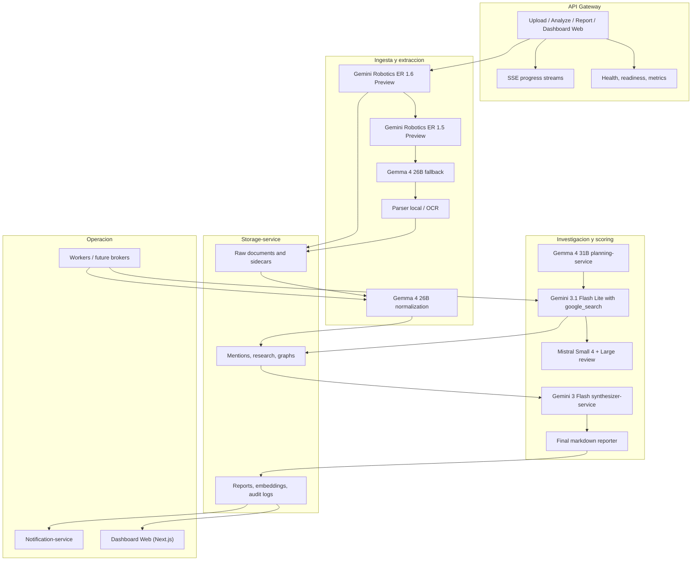

# Vigilador Tecnológico - Project Context

## System Overview

Enterprise technology surveillance system based on AI agents that analyzes internal documents, extracts technologies, normalizes them, and compares with current market state.

## Architecture Diagram



## Model Stack

| Purpose | Primary | Fallback 1 | Fallback 2 |
|---------|---------|------------|------------|
| Document Ingestion | Gemini Robotics ER 1.6 Preview | Gemini Robotics ER 1.5 Preview | Gemma 4 26B |
| Central Reasoning | Gemma 4 31B | - | - |
| Semantic Normalization | Gemma 4 26B | - | - |
| Web Search (Branch 1) | Gemini 3.1 Flash Lite + google_search | - | - |
| Web Search (Branch 2) | Mistral Small 4 | - | - |
| Review/Analysis | Gemma 4 26B | Mistral Large Latest | - |
| Final Synthesis | Gemini 3 Flash Preview | - | - |
| Embeddings | Gemini Embedding 2 | - | - |

## Services

- `api-gateway` - FastAPI HTTP entry point
- `dashboard-web` - Next.js frontend
- `document-ingest-worker` - Async document processing
- `extraction-worker` - Technology extraction
- `normalization-service` - Semantic normalization with Gemma 4
- `research-service` - Research orchestration
- `planning-service` - Research planning with Gemma 4 31B
- `synthesizer-service` - Final report synthesis
- `scoring-service` - Market comparison and risk evaluation
- `report-service` - Report generation
- `storage-service` - Modular storage for all artifacts
- `notification-service` - Critical alerts and operational failures

## Project Structure

```
src/vigilador_tecnologico/
  api/                      # HTTP entry, SSE exposure
    _research_operations.py # Research operation state logic
    _sse_formatters.py      # SSE payload formatting
    documents.py            # Document endpoints with DI container
    sse_routes.py           # SSE routing
    main.py                 # FastAPI app
  contracts/
    models.py               # Source of truth for data shapes
  integrations/
    credentials.py          # ONLY module reading env/.env
    document_ingestion.py   # Document ingestion adapter
    gemini.py               # Gemini API adapter
    groq.py                 # Groq adapter
    mistral.py              # Mistral adapter
    model_profiles.py       # Model configurations
    retry.py                # Retry utilities
  pipeline/
    graph_orchestrator.py   # LangGraph orchestration
    nodes.py                # Thin node wrappers
    state.py                # State types
  services/
    _stage_context.py       # build_stage_context utility
    embedding.py            # Embedding service
    extraction.py           # Technology extraction
    normalization.py        # Semantic normalization
    notification.py         # Alert persistence
    planning.py             # Research planning
    prompt_engineering.py   # Query refinement (tool-free)
    reporting.py            # Report generation
    research.py             # Research orchestration
    research_analysis.py    # Web result analysis per branch
    scoring.py              # Risk/market scoring
    synthesizer.py          # Final synthesis
    web_search.py           # Web search per branch
  storage/
    documents.py            # Document repository
    operations.py           # Operation journal repository
    service.py              # Storage service facade
  workers/
    analysis.py             # Document analysis executor
    orchestrator.py         # Pipeline orchestrator
    research.py             # Research worker
schemas/                    # JSON Schema source of truth
frontend/                   # Next.js 14 dashboard
```

## Key Contracts

### TechnologyMention
```json
{
  "mention_id": "string",
  "document_id": "string",
  "source_type": "pdf|image|docx|pptx|sheet|text",
  "page_number": 0,
  "raw_text": "string",
  "technology_name": "string",
  "normalized_name": "string",
  "vendor": "string",
  "category": "language|framework|database|cloud|tool|other",
  "version": "string",
  "confidence": 0.0,
  "evidence_spans": [],
  "context": "string",
  "source_uri": "string"
}
```

### TechnologyResearch
```json
{
  "technology_name": "string",
  "status": "current|deprecated|emerging|unknown",
  "summary": "string",
  "checked_at": "string",
  "breadth": 1,
  "depth": 1,
  "latest_version": "string",
  "release_date": "string",
  "alternatives": [],
  "source_urls": [],
  "visited_urls": [],
  "learnings": [],
  "fallback_history": []
}
```

### TechnologyReport
```json
{
  "report_id": "string",
  "document_scope": [],
  "executive_summary": "string",
  "technology_inventory": [],
  "comparisons": [],
  "risks": [],
  "recommendations": [],
  "sources": []
}
```

### AnalysisStreamEvent
```json
{
  "event_id": "string",
  "sequence": 1,
  "operation_id": "string",
  "operation_type": "research|analysis",
  "operation_status": "queued|running|completed|failed",
  "event_type": "string",
  "status": "string",
  "message": "string",
  "node_name": "string",
  "document_id": "string",
  "idempotency_key": "string",
  "details": {},
  "stage_context": {},
  "failed_stage": "string",
  "technology": "string",
  "report_markdown": "string",
  "report_artifact": {}
}
```

## API Endpoints

### Documents
- `POST /api/v1/documents/upload` - Upload document (Base64)
- `GET /api/v1/documents/{document_id}/status` - Get document status
- `POST /api/v1/documents/{document_id}/extract` - Extract mentions
- `GET /api/v1/documents/{document_id}/extract` - Read persisted mentions
- `POST /api/v1/documents/{document_id}/analyze` - Start full analysis
- `GET /api/v1/documents/{document_id}/analyze/stream` - SSE progress stream
- `GET /api/v1/documents/{document_id}/report` - Get persisted report
- `GET /api/v1/documents/{document_id}/report/download` - Download Markdown report

### Research
- `GET /api/v1/research/stream?technology=...&breadth=...&depth=...` - Research stream
- `GET /api/v1/chat/stream?query=...&idempotency_key=...` - Conversational research

### Operations
- `GET /api/v1/operations/{operation_id}` - Get operation journal

### Health
- `GET /health` - Liveness probe
- `GET /readyz` - Readiness probe (storage write test)
- `GET /metrics` - Operational snapshot

## Event Flow

1. `DocumentUploaded`
2. `DocumentParsed`
3. `TechnologiesExtracted`
4. `TechnologiesNormalized`
5. `ResearchRequested` (triggers LangGraph state machine)
6. `ResearchNodeEvaluated` (SSE progress per node)
7. `ResearchCompleted`
8. `ReportGenerated`
9. `AnalysisFailed` (shared terminal failure event)

## Research Flow (LangGraph)

```
PromptImprovementStarted -> PromptImproved -> ResearchRequested -> ResearchPlanCreated
     |
     v
Serial Branch Execution (no concurrent model calls):
  Branch 1: Gemini 3.1 Flash Lite -> Gemma 4 26B -> Gemini Embedding 2
  Branch 2: Mistral Small 4 -> Mistral Large Latest -> Gemini Embedding 2
     |
     v
Synthesis (Gemini 3 Flash Preview) -> ReportGenerated
```

### Breadth/Depth Constraints
- Each planner round produces max `breadth` unique queries
- Worker executes max same budget per round
- `depth` only advances after closing each web extraction
- Document pipeline uses explicit contract: `breadth=3`, `depth=1`

## Frontend (dashboard-web)

Next.js 14 App Router, React 18, TypeScript 6, Tailwind CSS

### Responsibilities
- Upload documents and build stable `document_id`
- Trigger `POST /api/v1/documents/{document_id}/analyze` with `idempotency_key`
- Listen `GET /api/v1/documents/{document_id}/analyze/stream` dedupe by `event_id`
- Display mentions, comparisons, risks, recommendations, sources, knowledge graph
- Rehydrate UI from Supabase snapshots or `localStorage` fallback

### Key Components
- `DashboardWorkspace.tsx` - UI state orchestrator
- `DocumentIngest.tsx` - File selection, Base64, upload
- `AnalysisStream.tsx` - SSE client, event deduplication
- `KnowledgeGraph.tsx` - Interactive node visualization
- `ReportSection.tsx` - Report display, download links

### Environment Variables
- `NEXT_PUBLIC_API_BASE_URL` - Browser HTTP calls (default: `http://127.0.0.1:8000`)
- `BACKEND_API_BASE_URL` - Internal rewrites target
- `NEXT_PUBLIC_SUPABASE_URL` - Supabase project URL
- `NEXT_PUBLIC_SUPABASE_ANON_KEY` - Supabase anon key

## Source Files (Truth)

| Type | Location |
|------|----------|
| Data contracts | `src/vigilador_tecnologico/contracts/models.py` |
| JSON Schemas | `schemas/*.schema.json` |
| Environment | `src/vigilador_tecnologico/integrations/credentials.py` ONLY |
| Project rules | `.vscode/rules.md` |
| Specification | `spec.md` |

## Validation Commands

```bash
# Install
pip install -e .

# Start all (Windows)
start_all.bat

# E2E smoke test
python -m unittest tests.test_live_e2e

# SSE streaming test
python -m unittest tests.test_sse_stream

# Mistral fallback test
python -m unittest tests.test_mistral_adapter

# Operational endpoints
python -m unittest tests.test_operational_endpoints tests.test_document_analyze

# Docker build
docker compose up --build
```

## Implementation Guardrails (from memory)

### Vigilador Workflow (ALL tasks)
1. Read `.vscode/rules.md`
2. Read `spec.md`
3. Identify smallest owned slice, form one hypothesis
4. Plan before editing
5. Implement minimum safe edit
6. Review with targeted validation
7. Update `spec.md` if behavior/contracts/architecture changed
8. Update `.vscode/rules.md` if working rules changed
9. Stop when validated or concrete blocker remains

### Karpathy Guardrails (non-trivial tasks)
1. Clarify ambiguity before coding
2. State assumptions and non-goals explicitly
3. Define measurable success criteria and validation approach
4. Select smallest owning file slice
5. Implement minimum safe change only
6. Run targeted validation until pass or explicit blocker
7. Sync docs/contracts/rules if behavior/constraints changed

## Critical Rules (from .vscode/rules.md)

### Boundaries
- **Credential boundary**: ONLY `credentials.py` reads env/.env
- **Adapter boundary**: All model calls through `integrations/` adapters
- **Contract boundary**: Services normalize to `contracts/models.py` types
- **Deterministic core**: Keep outputs deterministic unless model-backed

### Architecture
- **State Machine Isolation**: Research MUST use LangGraph, no manual loops
- **No God Prompts**: Extract minimal learnings before passing to reasoner
- **Streaming First**: Long operations emit SSE progress
- **Shared Stage Context**: Use `build_stage_context()` everywhere
- **Decoupled Nodes**: LangGraph nodes are thin wrappers, logic in services
- **Research Worker Composition**: `ResearchWorker` = orchestration only
- **SSE Routing Split**: Formatting in `_sse_formatters.py`, state in `_research_operations.py`
- **Documents API DI**: Use `AppDependencies` container, no global singletons

### Research Identity
- **Canonical Research Identity**: Build one request before LangGraph
- **Planner Uses Refined Brief**: Consume refined `query`, not raw target
- **No Early ResearchRequested**: Chat order: `PromptImprovementStarted -> PromptImproved -> ResearchRequested`
- **Chat Retry Identity**: Frontend generates per-attempt `idempotency_key`
- **Mutable Research Identity**: Never rewrite `target_technology`, `breadth`, `depth` after operation exists

### JSON/Fallback
- **JSON Validation First**: Parse and shape-check all LLM JSON output
- **Explicit Prompt Fallbacks Only**: Surface `fallback_reason` in `stage_context`
- **Tool-Free Prompt Refinement**: No web search tools in prompt engineering

### SSE/Events
- **Chat SSE Contract**: Same envelope as `analyze/stream`
- **Journal Sequencing**: Monotonic `sequence`, explicit `event_key` for dedupe
- **Split SSE Reports**: `report_markdown` for research, `report_artifact` for documents
- **Shared Failure Event**: All streams use `AnalysisFailed` as terminal
- **Terminal Operations Not Reusable**: Never reuse completed/failed operations

### Code Guardrails (DO NOT)
- Manual context dicts - use `build_stage_context()`
- In-node prompting - move to services
- Service introspection - use `*_with_context` API
- Model profile leakage in pipeline
- Direct adapter instantiation in nodes
- `getattr`/`hasattr` in orchestrator
- Ambiguous `report` field in SSE
- Locale-dependent SSR text formatting

## Known Gaps (v1)

- Research/scoring: preserve breadth/depth, visited URLs, learnings, alternatives, version gaps, source URLs, risk severity, fallback history in operation trail
- Reporting: persisted retrievable artifact, read/download endpoint, dashboard with SSE progress
- Operations: notification-service, health/readiness/logging/metrics before gateway/workers/broker split

## Deployment

```yaml
# docker-compose.yml services
- api-gateway (8000)
- dashboard-web (3000)
- workers (future)
- broker/event-bus (future)
```

## Environment Setup

1. Copy `.env.example` to `.env`
2. Set `GEMINI_API_KEY`, `GROQ_API_KEY`, `MISTRAL_API_KEY`
3. Activate `.venv` (Python 3.13)
4. Run `start_all.bat` for local development
