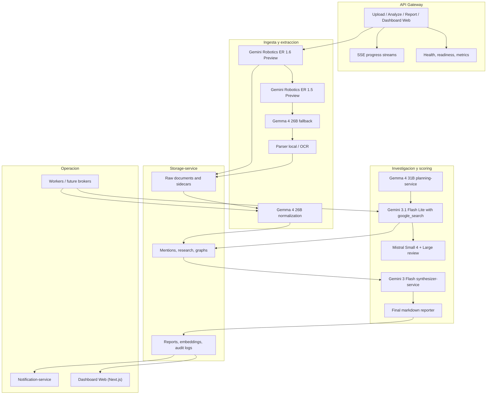

# Vigilador Tecnologico

Base inicial del sistema empresarial de vigilancia tecnologica basado en agentes.

## Diagrama de arquitectura



## Estructura propuesta

```text
src/vigilador_tecnologico/
  api/
  contracts/
  integrations/
    credentials.py
    document_ingestion.py
    gemini.py
    groq.py
  models/
  pipeline/
  services/
  storage/
  workers/
schemas/
frontend/
```

## Integraciones y credenciales

Las integraciones leen `GEMINI_API_KEY`, `GROQ_API_KEY` y `MISTRAL_API_KEY` desde el entorno. Si existe un `.env` local, se carga de forma automática al pedir una credencial por primera vez.

Los adaptadores principales están en `src/vigilador_tecnologico/integrations`:

- `GeminiAdapter` para llamadas a Gemini.
- `GroqAdapter` para llamadas a Groq.
- `MistralAdapter` para respaldo de investigación cuando Groq no responde.

Los servicios `ExtractionService`, `NormalizationService`, `ResearchService`, `PlanningService` y `SynthesizerService` ya consumen esos adaptadores. La extracción y normalización usan Gemma 4. En investigación web, el flujo conversacional hace una sola mejora de prompt con Gemma 4 26B, salta a planificación con Gemma 4 31B y luego ejecuta dos ramas seriales: `Gemini 3.1 Flash Lite -> Gemma 4 26B -> Gemini Embedding 2` y `Mistral Small 4 -> Mistral Large Latest -> Gemini Embedding 2`. La síntesis final usa `Gemini 3 Flash Preview`. El coordinador no abre llamadas concurrentes entre modelos y no avanza si una respuesta no valida su JSON. La extracción de menciones mantiene un fallback local determinista cuando Gemma 4 expira, devuelve JSON inválido o no produce menciones útiles.

La implementación actual desacopla investigación y streaming en slices explícitos:
- `workers/research.py` coordina el flujo de rama.
- `services/web_search.py` encapsula la búsqueda web por proveedor.
- `services/research_analysis.py` encapsula review/análisis por proveedor.
- `api/_sse_formatters.py` centraliza formatos de eventos SSE.
- `api/_research_operations.py` centraliza estado/ejecución de operaciones de research.
- `workers/analysis.py` centraliza la ejecución del análisis documental.

`ScoringService` cierra el flujo con comparación de mercado, evaluación de riesgos y recomendaciones deterministas a partir de las menciones normalizadas y la investigación externa.

`ReportingService` y `SynthesizerService` consolidan ese resultado en el informe final con inventario tecnológico, fuentes consolidadas y resumen ejecutivo. El orquestador `PipelineOrchestrator` consume los servicios mediante una interfaz estandarizada `*_with_context` y un constructor de contexto uniforme.
La entrada conversacional `GET /api/v1/chat/stream` construye primero una request canónica de research con `target_technology`, `breadth`, `depth`, `document_id` sintético e `idempotency_key` estable por intento. El dashboard genera ese `idempotency_key` para cada consulta nueva y lo reusa solo si necesita reanudar exactamente esa misma operación SSE. `PromptEngineeringService` solo puede mejorar `query`; no puede reescribir la identidad ni el presupuesto del research. En chat, `ResearchRequested` no se persiste antes de `PromptImproved`. Si Gemma 26B expira o devuelve JSON inválido en esa etapa, el sistema usa un brief determinista explícito y marca `fallback_reason` en el SSE; no finge que el modelo respondió bien. Después, `PlanningService` con Gemma 4 31B toma ese brief refinado, diseña el plan y `ResearchWorker` lo ejecuta en secuencia, sin consultas simultáneas a modelos y sin avanzar si una respuesta no valida su JSON. `SynthesizerService` consolida el resultado con `Gemini 3 Flash Preview`. Ese flujo emite `PromptImprovementStarted`, luego `PromptImproved`, luego `ResearchRequested`, `ResearchPlanCreated` y después continúa con el mismo sobre SSE base del dashboard. Los fallos terminales del research también usan `AnalysisFailed` para mantener un único contrato de UI.

La capa HTTP principal ya expone `GET /health`, `GET /readyz`, `GET /metrics`, `GET /api/v1/documents/{document_id}/extract`, `GET /api/v1/documents/{document_id}/report/download` y `GET /dashboard/{document_id}` para operación y consumo.
En `api/documents.py`, los colaboradores runtime se agrupan en `AppDependencies` y el lanzamiento de análisis usa `asyncio.Lock` para evitar condiciones de carrera entre requests concurrentes del mismo `operation_id`.

`NotificationService` registra alertas críticas y fallos operativos en el audit log cuando el scoring detecta riesgos altos o críticos o cuando una operación falla.

## Frontend web
El frontend vive en `frontend/` y se despliega como `dashboard-web`. Es una app Next.js 14 con App Router, React 18, TypeScript 6 y Tailwind CSS. Su trabajo es consumir el backend, renderizar la ingesta, el stream SSE, el grafo, el reporte final y la capa de snapshots para que la UI pueda rehidratar estado sin volver a ejecutar el pipeline.
`AnalysisStream` consume `stage_context` y `failed_stage` desde los eventos SSE para mostrar la etapa exacta, el modelo usado y el punto de fallo real sin exponer razonamiento crudo.
Cuando el origen es `chat/stream`, `AnalysisStream` usa un `document_id` sintético del research para el stream, pero solo hidrata menciones o reportes cuando coincide con un `document_id` real del pipeline documental.

### Responsabilidades
* Subir documentos y construir el `document_id` estable.
* Disparar `POST /api/v1/documents/{document_id}/analyze` con `idempotency_key` y abrir el stream SSE para ver progreso en vivo sin bloquear la UI.
* Escuchar `GET /api/v1/documents/{document_id}/analyze/stream` y deduplicar eventos por `event_id`.
* Mostrar menciones, comparaciones, riesgos, recomendaciones, fuentes y grafo de conocimiento.
* Rehidratar la UI desde snapshots persistidos en Supabase o, como respaldo, `localStorage`.
* Exponer una experiencia unica de dashboard sin requerir acceso directo del navegador al backend interno.

### Estructura del frontend
* `frontend/src/app/layout.tsx`: layout global, metadata y carga de estilos.
* `frontend/src/app/page.tsx`: punto de entrada que monta `DashboardWorkspace`.
* `frontend/src/app/globals.css`: tokens visuales, fondo, sombras y reglas de impresion.
* `frontend/src/components/DashboardWorkspace.tsx`: orquestador de estado de la UI y coordinador del flujo upload -> analyze -> SSE -> report.
* `frontend/src/components/DocumentIngest.tsx`: selector de archivos, lectura Base64, inferencia de `source_type` y subida.
* `frontend/src/components/AnalysisStream.tsx`: cliente SSE, deduplicacion por `event_id`, carga diferida de menciones, operation record y reporte.
* `frontend/src/components/KnowledgeGraph.tsx`: vista interactiva de nodos con evidencias, vendor, version, URLs y alternativas.
* `frontend/src/components/ReportSection.tsx`: vista del reporte, metricas resumidas y enlaces de descarga.
* `frontend/src/components/ui/`: primitives de UI reutilizables.
* `frontend/src/lib/api.ts`: helpers HTTP y constructores de URLs SSE/descarga.
* `frontend/src/lib/utils.ts`: utilidades de UI.
* `frontend/src/services/supabaseClient.ts`: persistencia de snapshots y artifacts del dashboard en Supabase o `localStorage`.
* `frontend/src/types/contracts.ts`: espejo tipado de los contratos del backend para el dashboard, incluyendo `report_markdown` para research y `report_artifact` para documentos.
* `frontend/src/types/global.d.ts`: declaraciones globales para que TypeScript acepte imports CSS.
* `frontend/next.config.mjs`: rewrites del frontend hacia el backend interno.
* `frontend/tsconfig.json`: alias `@/*`, strict mode y configuracion TypeScript.
* `frontend/package.json`: scripts, dependencias y version de runtime del dashboard.

### Variables de entorno del frontend
* `NEXT_PUBLIC_API_BASE_URL`: base publica para llamadas HTTP desde el browser. Si se deja vacia, el frontend usa `http://127.0.0.1:8000` para evitar truncamiento de uploads grandes en el proxy de Next.
* `BACKEND_API_BASE_URL`: destino interno que siguen usando las rewrites de `next.config.mjs` para compatibilidad local con `/api/v1/*`, `/health`, `/readyz`, `/metrics` y `/dashboard/*`. Por defecto apunta a `http://127.0.0.1:8000`.
* `NEXT_PUBLIC_SUPABASE_URL`: URL del proyecto Supabase usado para snapshots durables.
* `NEXT_PUBLIC_SUPABASE_ANON_KEY`: clave anonima de Supabase usada por el dashboard.

### Flujo de datos del dashboard
1. `DocumentIngest` lee el archivo, lo convierte a Base64 y llama `uploadDocument`.
2. `DashboardWorkspace` genera y conserva el `idempotency_key`: derivado del documento para análisis documental y único por intento para chat.
3. `DashboardWorkspace` dispara `POST /api/v1/documents/{document_id}/analyze` como operación ligera y abre `AnalysisStream` para ver el progreso en vivo sin duplicar eventos.
4. `DashboardWorkspace` y `AnalysisStream` persisten snapshots del estado de la UI para rehidratacion posterior.
5. `KnowledgeGraph` consume menciones persistidas y el reporte para mostrar nodos, alternativas y fuentes.
6. `ReportSection` muestra el reporte final y habilita la descarga Markdown/PDF una vez disponible.

### Rutas y proxy
* El browser muestra la UI en `http://localhost:3000`, pero las llamadas API del dashboard van por defecto a `http://127.0.0.1:8000`.
* `frontend/src/lib/api.ts` usa `NEXT_PUBLIC_API_BASE_URL` si existe; si no, cae al backend directo en `127.0.0.1:8000`.
* `frontend/next.config.mjs` conserva rewrites hacia `BACKEND_API_BASE_URL` como compatibilidad local y para acceso manual, pero el cliente ya no depende del proxy para upload/analyze.
* En docker-compose, `dashboard-web` queda en `3000` y el backend logico en `8000`.

### Contratos que usa el frontend
* `frontend/src/types/contracts.ts` debe permanecer alineado con `src/vigilador_tecnologico/contracts/models.py` y con los JSON Schemas de `schemas/`.
* Los tipos de frontend no son la fuente de verdad; son un espejo de consumo para la UI.
* Si cambia un evento, un campo de `TechnologyReport`, una respuesta de `analyze` o una forma de snapshot, el contrato del frontend debe actualizarse en la misma entrega.

### Comportamiento operativo
* La UI conserva estado de documento, menciones, operation record, eventos SSE y reporte para poder restaurar una sesion por `document_id`.
* `AnalysisStream` deduplica por `event_id` y no debe volver a abrir un `EventSource` en cada re-render.
* El chat usa un `document_id` sintético para mantener trazabilidad, pero no debe disparar hydration de menciones o reporte si no coincide con un documento persistido del pipeline documental.
* `supabaseClient` persiste primero en Supabase and, if not available, uses `localStorage` as local backup.
* La capa de estilos vive en `globals.css` y define tokens visuales, fondo, estados de impresion y el shell del dashboard.

La base de despliegue local queda preparada con `Dockerfile` y `docker-compose.yml`, incluyendo `api-gateway`, `dashboard-web`, workers y broker/event bus como punto de partida para una separación futura más estricta.

## Validación

Usa siempre la única venv del proyecto (`.venv`, Python 3.13) para evitar mezclar el `python` global de Windows con el entorno del repo.

Arranque local recomendado:

```bash
start_all.bat
```

`start_all.bat` levanta backend y frontend en una sola sesión estable. Como el backend corre sin `--reload` para evitar procesos duplicados en Windows, vuelve a ejecutar este launcher cada vez que cambies código del servidor.

Comando único de verificación end-to-end en vivo:

```bash
.\.venv\Scripts\python.exe -m unittest tests.test_live_e2e
```

La ruta de investigación con streaming SSE queda cubierta por el test de integración `tests/test_sse_stream.py`.

```bash
.\.venv\Scripts\python.exe -m unittest tests.test_sse_stream
```

Los endpoints operativos y de notificación quedan cubiertos por `tests/test_operational_endpoints.py` y por las pruebas de análisis que validan la persistencia del reporte y las alertas críticas.

```bash
.\.venv\Scripts\python.exe -m unittest tests.test_operational_endpoints tests.test_document_analyze
```

El adaptador real de Mistral queda cubierto por `tests/test_mistral_adapter.py`.

```bash
.\.venv\Scripts\python.exe -m unittest tests.test_mistral_adapter
```

Despliegue local reproducible:

```bash
docker compose up --build

El compose local también levanta `dashboard-web`, el frontend Next.js que consume el backend FastAPI.
```

Ejemplo mínimo:

```python
from vigilador_tecnologico.integrations import GeminiAdapter

searcher = GeminiAdapter(model="gemini-3.1-flash-lite-preview")
planner = GeminiAdapter(model="gemma-4-31b-it")
reporter = GeminiAdapter(model="gemini-3-flash-preview")
```

Parte de `.env.example` y copia las claves reales a `.env` en local.

## Contratos principales

- `TechnologyMention`
- `TechnologyResearch`
- `TechnologyReport`
- `AnalysisStreamEvent`
- `OperationEvent` con `sequence` monotónica y `event_key` opcional

## Fase inicial

1. Ingesta documental (Workers Asíncronos con Celery/RabbitMQ).
2. Extraccion multimodal de tecnologias (Gemini Robotics ER 1.6 -> Gemini Robotics ER 1.5 -> Gemma 4 26B).
3. Normalizacion semantica y persistencia con Gemma 4.
4. **Investigacion externa (Deep Research Loop)**: Orquestado con LangGraph usando el patrón Supervisor-Worker con control estricto de Amplitud (Breadth) y Profundidad (Depth). Cada iteración del planner produce como máximo `breadth` queries únicas, el worker ejecuta como máximo ese mismo presupuesto por ronda y `depth` solo avanza al cerrar cada extracción web.
5. **Streaming de Progreso**: Exposición de eventos en tiempo real mediante Server-Sent Events (SSE) vía FastAPI.
6. Generacion de informe y alertas consolidadas mediante Gemma 4.

Para el pipeline documental, el orquestador usa un contrato explícito `breadth=3` y `depth=1`; no descubre esos parámetros por introspección del servicio.
