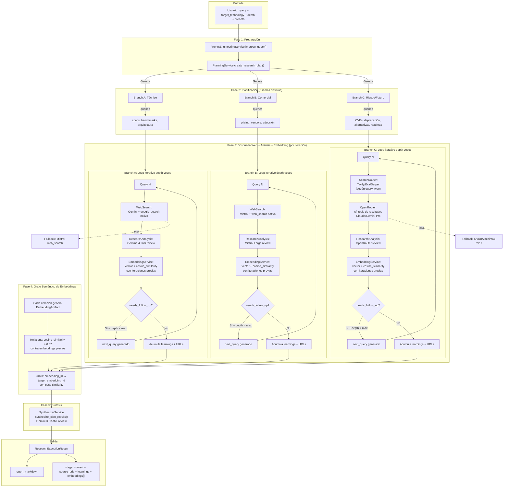
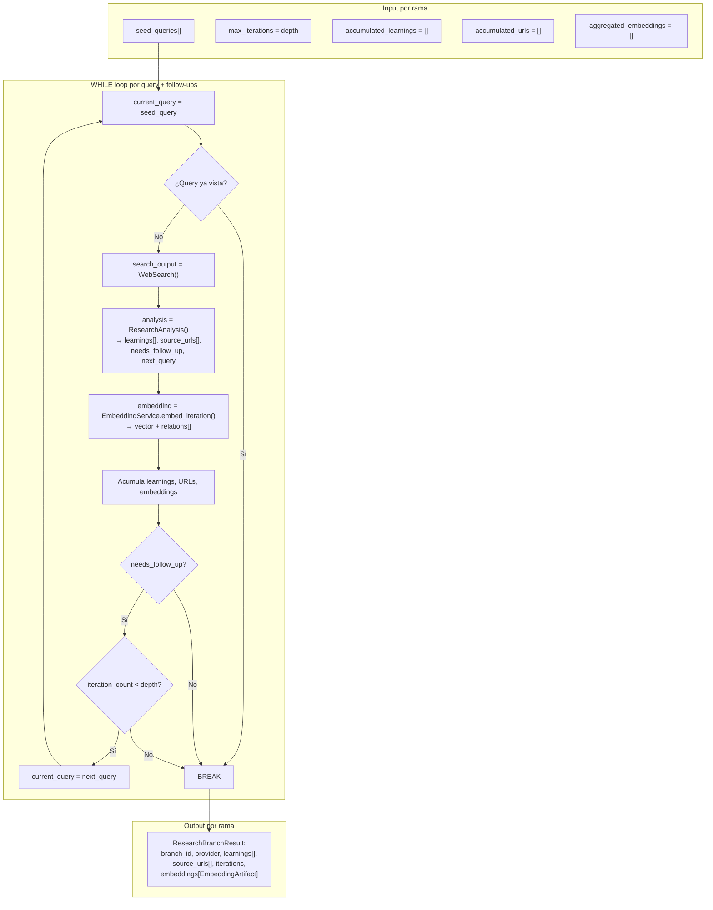
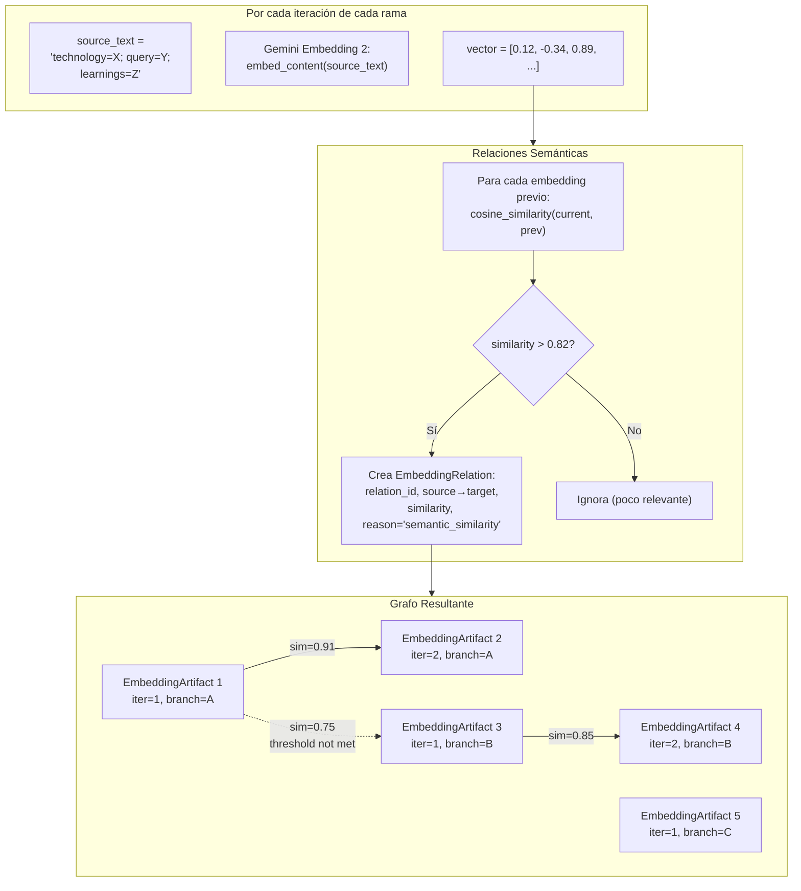
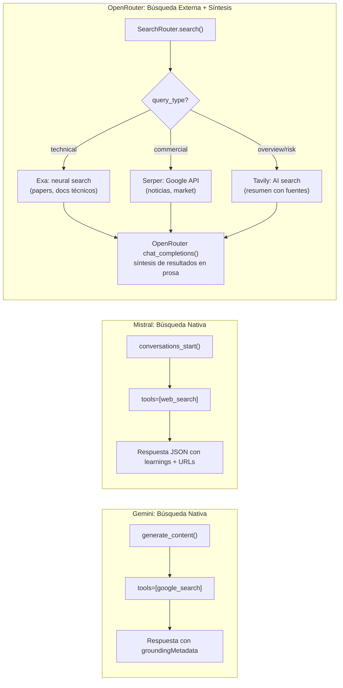
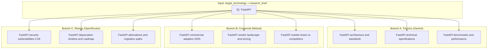
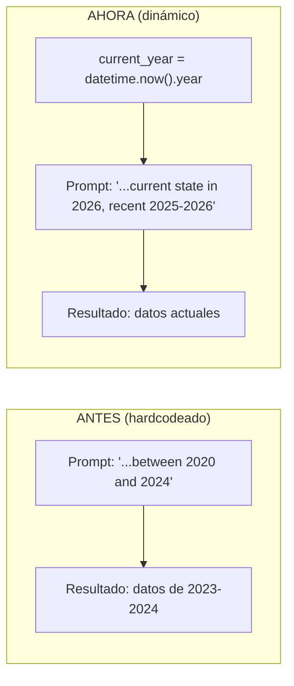
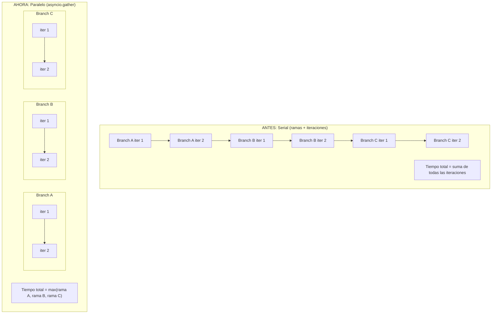
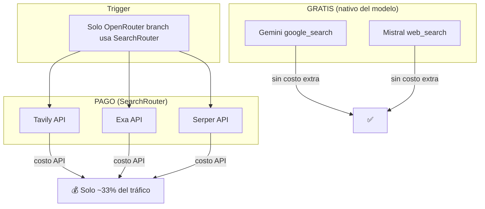
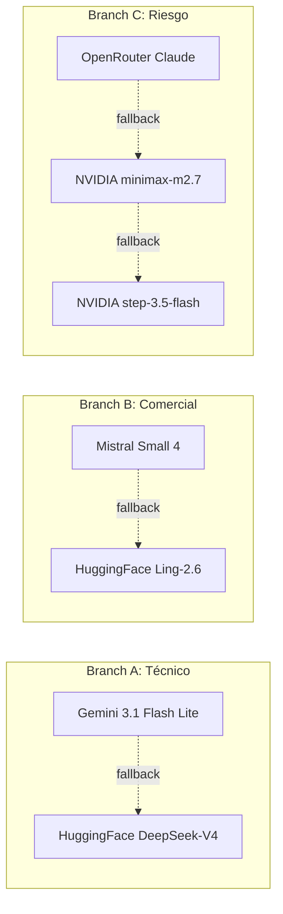
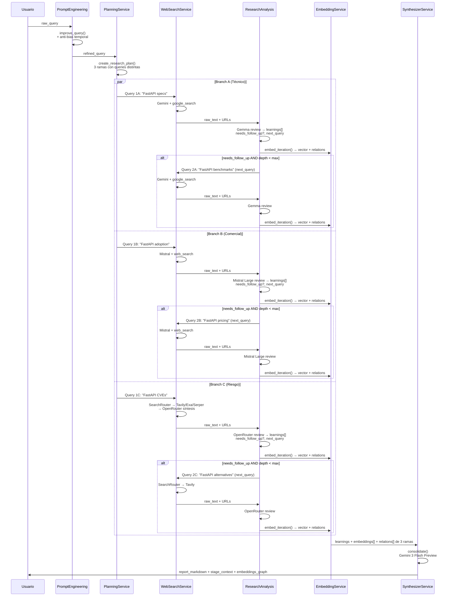

# Diagrama de Arquitectura del Research

## Flujo Principal de Investigación (Deep Research)

---

## Loop Iterativo por Rama (Detalle)

---

## Embeddings y Grafo Semántico (Detalle)

---

## Flujo de Búsqueda por Proveedor

---

## Estrategia de Queries Diversificadas

---

## Anti-Bias Temporal

---

## Ejecución Paralela vs Serial

---

## Cost Optimization: Cuándo se paga API de búsqueda

---

## Fallback Chain

---

## Sequence Diagram Completo (con embeddings + follow-ups)

