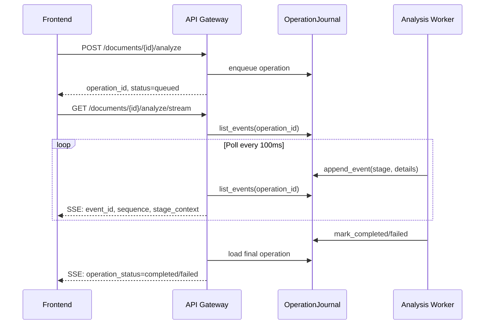

# API Gateway Module

## Propósito del Módulo

El módulo `api/` actúa como la puerta de entrada HTTP principal del sistema Vigilador Tecnológico. Implementa una capa FastAPI que expone endpoints para:

- **Subida y análisis documental**: Upload, parse, extract, analyze con streaming SSE
- **Investigación conversacional**: Chat/stream para queries de investigación ad-hoc
- **Operaciones y journaling**: Consulta de operaciones por `operation_id`
- **Salud operativa**: Health checks, readiness probes y métricas

Este módulo coordina la ejecución asíncrona de workers y servicios sin contener lógica de negocio directa, manteniendo la separación entre exposición HTTP y ejecución del pipeline.

## Interfaz y Contratos

### Inputs (Request Models)

| Modelo | Origen | Descripción |
|--------|--------|-------------|
| `DocumentUploadRequest` | Frontend dashboard | `filename`, `content` (Base64), `source_type` opcional |
| `DocumentAnalyzeRequest` | Frontend dashboard | `idempotency_key` para reanudación |
| `ResearchStreamRequest` | Frontend dashboard | `technology`, `breadth`, `depth` |
| `ChatStreamRequest` | Frontend dashboard | `query`, `idempotency_key` único por intento |

### Outputs (Response Models)

| Modelo | Destino | Descripción |
|--------|---------|-------------|
| `DocumentUploadResponse` | Frontend | `document_id`, `checksum`, `raw_text`, `page_count` |
| `DocumentAnalyzeResponse` | Frontend | `operation_id`, `status`, `report_id`, `reused` |
| `AnalysisStreamEvent` | Frontend (SSE) | Eventos de progreso con `stage_context` y `failed_stage` |
| `OperationRecord` | Frontend | Journal completo de operación con eventos |
| `TechnologyReport` | Frontend/Storage | Reporte final estructurado |

### Contratos Clave

```python
# contracts/models.py
class AnalysisStreamEvent(TypedDict):
    event_id: str
    sequence: int
    operation_id: str
    operation_type: Literal["research", "analysis"]
    operation_status: Literal["queued", "running", "completed", "failed"]
    event_type: str
    status: str
    message: str
    nodo: str
    document_id: str
    idempotency_key: str
    details: dict[str, Any]
    stage_context: NotRequired[StageContext]
    failed_stage: NotRequired[str]
    technology: NotRequired[str]
    report_markdown: NotRequired[str]      # Para chat/stream
    report_artifact: NotRequired[TechnologyReport]  # Para documents/analyze
```

## Conexiones y Dependencias

### Hacia Arriba (Quién lo invoca)

| Módulo | Endpoints Consumidos | Propósito |
|--------|---------------------|-----------|
| `dashboard-web` (Next.js) | Todos los endpoints `/api/v1/*` | UI de ingesta, streaming, reporte |
| Tests E2E | `/health`, `/readyz`, `/metrics` | Validación operativa |
| Scripts externos | `/api/v1/documents/*` | Automatización de análisis |

### Hacia Abajo (Qué consume)

| Módulo | Uso |
|--------|-----|
| `DocumentIngestWorker` | Parseo de documentos (PDF, imágenes, Office) |
| `ExtractionService` | Extracción de menciones tecnológicas |
| `PipelineOrchestrator` | Orquestación del pipeline completo |
| `ResearchWorker` | Ejecución de investigación LangGraph |
| `StorageService` | Persistencia de documentos, menciones, reportes |
| `OperationJournal` | Journal de operaciones para recovery |
| `NotificationService` | Alertas críticas y fallos operativos |

## Lógica de Resiliencia

El módulo implementa coherencia operativa por diseño mediante los siguientes mecanismos:

### Idempotencia Garantizada

- Cada operación de análisis recibe un `idempotency_key` estable
- Si la misma clave + `document_id` ya existe, se reutiliza el `operation_id` sin reejecutar
- El frontend genera claves únicas por intento en `chat/stream`
- El backend deriva claves del checksum del documento para análisis documental

### Recovery de Operaciones

```python
# api/documents.py
async def _launch_analysis_operation(...) -> asyncio.Task[Any] | None:
    # Verifica si la operación ya está en estado terminal
    if operation["status"] in {"completed", "failed"}:
        return None
    
    # Evita duplicación con asyncio.Lock por operation_id
    async with dependencies.analysis_launch_lock:
        existing_task = dependencies.analysis_launch_tasks.get(operation_id)
        if existing_task and not existing_task.done():
            return existing_task  # Reutiliza tarea existente
        
        task = asyncio.create_task(asyncio.to_thread(_execute_analysis_operation, ...))
        dependencies.analysis_launch_tasks[operation_id] = task
```

### SSE con Reanudación

- Los eventos se persisten en `OperationJournal` con `sequence` monotónica
- El stream puede reconectarse y reanudar desde el último `event_id`
- Deduplicación por `event_id` en el cliente frontend
- Mismo contrato de eventos para `analyze/stream` y `chat/stream`

### Fallback de Proveedores

Cuando un proveedor de modelos falla, el sistema:

1. Registra `fallback_reason` en `stage_context` (ej: `timeout`, `invalid_json`, `provider_failure`)
2. Continúa con el siguiente proveedor en la cadena
3. Emite eventos SSE que reflejan el modelo real usado
4. El dashboard muestra la etapa exacta y el punto de fallo sin exponer razonamiento crudo

## Flujo de Datos

### Pipeline de Análisis Documental

```mermaid
flowchart TD
    A[POST /documents/upload] --> B[DocumentStorage.save]
    B --> C[DocumentIngestWorker.ingest]
    C --> D{Modelo disponible?}
    D -->|Gemini 1.6| E[Gemini Robotics ER 1.6]
    D -->|Fallback 1| F[Gemini Robotics ER 1.5]
    D -->|Fallback 2| G[Gemma 4 26B]
    D -->|Todos fallan| H[Parser local/OCR]
    E --> I[DocumentStorage.save_parsed]
    F --> I
    G --> I
    H --> I
    I --> J[POST /documents/{id}/analyze]
    J --> K[PipelineOrchestrator.run_document]
    K --> L[Extract → Normalize → Research → Score → Report]
    L --> M[StorageService.persist_artifacts]
    M --> N[NotificationService.notify_critical_risks]
    N --> O[OperationJournal.mark_completed]
```

### Streaming SSE (Analyze/Chat)



### Endpoints Principales

| Endpoint | Método | Propósito | Idempotente |
|----------|--------|-----------|-------------|
| `/documents/upload` | POST | Subida Base64 con parseo | No (crea documento) |
| `/documents/{id}/status` | GET | Estado persistido | Sí |
| `/documents/{id}/extract` | POST/GET | Extraer o leer menciones | Sí (GET) |
| `/documents/{id}/analyze` | POST | Iniciar análisis | Sí (por idempotency_key) |
| `/documents/{id}/analyze/stream` | GET | SSE progress | Sí |
| `/documents/{id}/report` | GET | Reporte JSON | Sí |
| `/documents/{id}/report/download` | GET | Descarga Markdown | Sí |
| `/research/stream` | GET | Investigación ad-hoc | Sí |
| `/chat/stream` | GET | Investigación conversacional | Sí (por idempotency_key) |
| `/operations/{id}` | GET | Journal de operación | Sí |
| `/health` | GET | Liveness probe | Sí |
| `/readyz` | GET | Readiness con write test | Sí |
| `/metrics` | GET | Snapshot operativo | Sí |

## Estructura de Archivos

```
api/
├── __init__.py
├── main.py                    # FastAPI app, health/readymetrics
├── documents.py               # Endpoints documentales (upload, analyze, stream)
├── sse_routes.py              # Rutas SSE de investigación
├── operations.py              # Endpoints de operaciones/journal
├── _sse_formatters.py         # Formato de payloads SSE
└── _research_operations.py    # Estado y ejecución de operaciones de research
```

## Consideraciones Operativas

### Concurrencia

- `asyncio.Lock` por `operation_id` previene condiciones de carrera entre requests concurrentes
- Tareas de análisis se mantienen en `analysis_launch_tasks` hasta completarse
- Cleanup automático vía `add_done_callback` cuando la tarea termina

### Determinismo

- Ingesta de texto plano se resuelve localmente (sin gasto de cuota LLM)
- Fallbacks registran `fallback_reason` explícita en `stage_context`
- No se permiten fallbacks silenciosos que finjan respuesta exitosa

### Dashboard Web

El endpoint `/dashboard/{document_id}` expone una vista mínima HTML/JS que:

- Consume SSE directamente desde el backend
- Carga el reporte Markdown desde `/report/download`
- Muestra progreso, estado de operación y log de eventos
- Sirve como fallback cuando el frontend Next.js no está disponible
