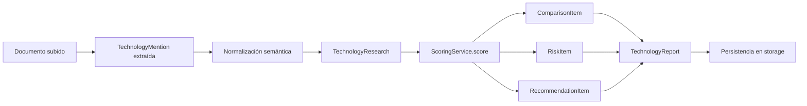

# Contracts Module

## Propósito del Módulo

El módulo `contracts/` es la **fuente de verdad única** para todas las formas de datos en el sistema Vigilador Tecnológico. Define los contratos tipados que garantizan coherencia a través de:

- **API Gateway**: Request/Response models validados por Pydantic
- **Services**: Inputs/outputs de extracción, normalización, investigación, scoring
- **Storage**: Estructuras persistidas en disco (JSON sidecars)
- **Workers**: Registros de operaciones y eventos de auditoría
- **Frontend**: Tipos espejo en TypeScript para consumo seguro

Todos los tipos están definidos como `TypedDict` con anotaciones `NotRequired` para campos opcionales, permitiendo validación estática con mypy y compatibilidad con JSON Schema.

## Interfaz y Contratos

### Tipos Enumerados (Literals)

```python
# Fuente y estado documental
SourceType = Literal["pdf", "image", "docx", "pptx", "sheet", "text"]
DocumentStatus = Literal["UPLOADED", "PARSED", "EXTRACTED", "NORMALIZED", "RESEARCHED", "REPORTED"]

# Operaciones
OperationType = Literal["research", "analysis"]
OperationStatus = Literal["queued", "running", "completed", "failed"]

# Clasificación tecnológica
TechnologyCategory = Literal["language", "framework", "database", "cloud", "tool", "other"]
ResearchStatus = Literal["current", "deprecated", "emerging", "unknown"]

# Priorización de riesgos y recomendaciones
SeverityLevel = Literal["low", "medium", "high", "critical"]
RecommendationPriority = Literal["critical", "high", "medium", "low"]
EffortLevel = Literal["low", "medium", "high"]
ImpactLevel = Literal["low", "medium", "high"]

# Taxonomía de fallbacks
FallbackReason = Literal[
    "timeout",
    "invalid_json",
    "empty_response",
    "provider_failure",
    "grounded_postprocess",
    "planner_fallback",
    "gemini_timeout_to_mistral",
    "empty_local_fallback",
    "invalid_local_fallback",
]
```

### Contratos de Dominio Principal

#### TechnologyMention

Representa una tecnología extraída de un documento con evidencia trazable.

```python
class TechnologyMention(TypedDict):
    mention_id: str                    # Identificador único SHA1
    document_id: str                   # Documento de origen
    source_type: SourceType            # pdf|image|docx|pptx|sheet|text
    page_number: int                   # Página donde aparece
    raw_text: str                      # Texto crudo de la mención
    technology_name: str               # Nombre detectado
    normalized_name: str               # Nombre canónico normalizado
    category: TechnologyCategory       # language|framework|database|cloud|tool|other
    confidence: float                  # 0.0 a 1.0
    evidence_spans: list[EvidenceSpan] # Evidencia trazable
    source_uri: str                    # URI del documento
    vendor: NotRequired[str]           # Proveedor (opcional)
    version: NotRequired[str]          # Versión detectada (opcional)
    context: NotRequired[str]          # Contexto circundante (opcional)
```

#### TechnologyResearch

Resultado de investigación web sobre una tecnología específica.

```python
class TechnologyResearch(TypedDict):
    technology_name: str               # Tecnología investigada
    status: ResearchStatus             # current|deprecated|emerging|unknown
    summary: str                       # Resumen ejecutivo
    checked_at: datetime               # Timestamp de investigación
    breadth: NotRequired[int]          # Amplitud usada (queries únicas)
    depth: NotRequired[int]            # Profundidad alcanzada
    latest_version: NotRequired[str | None]      # Última versión conocida
    release_date: NotRequired[datetime | None]   # Fecha de release
    alternatives: NotRequired[list[AlternativeTechnology]]  # Alternativas de mercado
    source_urls: NotRequired[list[str]]            # URLs de fuentes
    visited_urls: NotRequired[list[str]]           # URLs visitadas
    learnings: NotRequired[list[str]]              # Aprendizajes clave
    fallback_history: NotRequired[list[str]]       # Historial de fallbacks
    stage_context: NotRequired[StageContext]       # Metadatos de etapa
```

#### TechnologyReport

Reporte final consolidado con inventario, comparaciones, riesgos y recomendaciones.

```python
class TechnologyReport(TypedDict):
    report_id: str                     # Identificador único del reporte
    generated_at: datetime             # Timestamp de generación
    executive_summary: str             # Resumen ejecutivo
    document_scope: list[DocumentScopeItem]      # Documentos analizados
    technology_inventory: list[InventoryItem]    # Inventario tecnológico
    comparisons: list[ComparisonItem]            # Comparaciones de mercado
    risks: list[RiskItem]                        # Riesgos identificados
    recommendations: list[RecommendationItem]    # Recomendaciones accionables
    sources: list[SourceItem]                    # Fuentes consolidadas
    metadata: NotRequired[dict[str, Any]]        # Metadatos operativos
```

#### AnalysisStreamEvent

Evento de progreso SSE para streaming en vivo al dashboard.

```python
class AnalysisStreamEvent(TypedDict):
    event_id: str                      # Identificador único del evento
    sequence: int                      # Secuencia monótona por operación
    operation_id: str                  # Operación padre
    operation_type: OperationType      # research|analysis
    operation_status: OperationStatus  # queued|running|completed|failed
    event_type: str                    # Tipo de evento (ej: DocumentParsed)
    status: str                        # Estado del evento
    message: str                       # Mensaje descriptivo
    nodo: str                          # Nodo ejecutor
    document_id: str                   # Documento asociado
    idempotency_key: str               # Clave de idempotencia
    details: dict[str, Any]            # Detalles específicos
    stage_context: NotRequired[StageContext]     # Contexto de etapa
    failed_stage: NotRequired[str]               # Etapa fallida (si aplica)
    technology: NotRequired[str]                 # Tecnología evaluada
    report_markdown: NotRequired[str]            # Reporte Markdown (chat/stream)
    report_artifact: NotRequired[TechnologyReport]  # Reporte estructurado (documents)
```

### StageContext (Metadatos de Etapa)

```python
class StageContext(TypedDict):
    stage: str                         # Nombre de la etapa
    model: str                         # Modelo usado
    fallback_reason: NotRequired[FallbackReason]  # Razón de fallback
    duration_ms: NotRequired[int]      # Duración en milisegundos
    failed_stage: NotRequired[str]     # Etapa fallida
    node_name: NotRequired[str]        # Nodo LangGraph
    grounding_queries: NotRequired[list[str]]     # Queries de grounding
    grounding_urls: NotRequired[list[str]]        # URLs de grounding
    breadth: NotRequired[int]          # Amplitud configurada
    depth: NotRequired[int]            # Profundidad configurada
    current_depth: NotRequired[int]    # Profundidad actual
    iteration: NotRequired[int]        # Iteración actual
    query_count: NotRequired[int]      # Cantidad de queries
    document_id: NotRequired[str]      # Documento asociado
    target_technology: NotRequired[str]  # Tecnología objetivo
    plan_id: NotRequired[str]          # ID del plan de research
    branch_id: NotRequired[str]        # ID de rama ejecutada
    branch_provider: NotRequired[ResearchBranchProvider]  # gemini_grounded|mistral_web_search
    embedding_count: NotRequired[int]  # Embeddings generados
```

## Conexiones y Dependencias

### Consumidores Directos

| Módulo | Uso de Contratos |
|--------|------------------|
| `api/` | Request/Response validation, SSE event formatting |
| `services/` | Input/output typing, contract normalization |
| `storage/` | JSON serialization, repository interfaces |
| `workers/` | Operation records, event journals |
| `pipeline/` | State machine state typing |
| `frontend/` | TypeScript type mirrors (`types/contracts.ts`) |

### JSON Schema Alignment

Los contratos `TypedDict` deben permanecer alineados con los JSON Schemas en `schemas/`:

- `schemas/technology_mention.schema.json`
- `schemas/technology_research.schema.json`
- `schemas/technology_report.schema.json`
- `schemas/analysis_stream_event.schema.json`

Cualquier cambio en `contracts/models.py` debe reflejarse en los archivos `.schema.json` correspondientes en la misma entrega.

## Lógica de Resiliencia

### Validación de Tipos en Tiempo de Ejecución

Los contratos usan `NotRequired` para campos opcionales, permitiendo:

- Evolución incremental sin romper compatibilidad
- Fallbacks que omiten campos no críticos
- Validación explícita antes de persistir o transmitir

```python
# services/extraction.py
mention: TechnologyMention = {
    "mention_id": mention_id,
    "document_id": document_id,
    # ... campos requeridos ...
}
# Campos opcionales se agregan solo si existen
vendor = self._optional_text(item.get("vendor"))
if vendor is not None:
    mention["vendor"] = vendor
```

### Coherencia de Enums

Todos los campos `Literal` están centralizados para evitar valores mágicos:

```python
# Fallback reason taxonomy (explícita y verificable)
FallbackReason = Literal[
    "timeout",              # Timeout de proveedor
    "invalid_json",         # JSON mal formado
    "empty_response",       # Respuesta vacía
    "provider_failure",     # Fallo de proveedor
    "grounded_postprocess", # Post-proceso de grounding falló
    "planner_fallback",     # Planner no respondió
    "gemini_timeout_to_mistral",  # Timeout Gemini → Mistral
    "empty_local_fallback",  # Fallback local vacío
    "invalid_local_fallback", # Fallback local inválido
]
```

### StageContext Centralizado

Todos los servicios usan `build_stage_context()` para construir metadatos de etapa, asegurando consistencia en:

- Audit log
- Eventos SSE
- Dashboard UI (muestra etapa exacta, modelo usado, punto de fallo)

```python
# services/_stage_context.py
def build_stage_context(
    stage: str,
    model: str | None = None,
    fallback_reason: FallbackReason | None = None,
    duration_ms: int | None = None,
    **extra: Any,
) -> StageContext:
    context: StageContext = {"stage": stage}
    if model:
        context["model"] = model
    if fallback_reason:
        context["fallback_reason"] = fallback_reason
    if duration_ms is not None:
        context["duration_ms"] = duration_ms
    context.update(extra)
    return context
```

## Flujo de Datos

### Ciclo de Vida de una Mención Tecnológica



### Secuencia de Eventos por Operación

```
1. DocumentUploaded         → status: UPLOADED
2.DocumentParsed           → status: PARSED, stage_context: {model, fallback_reason}
3. TechnologiesExtracted   → mention_count, stage_context: {model, duration_ms}
4. TechnologiesNormalized  → normalized_count, stage_context: {model, fallback_reason}
5. ResearchRequested       → breadth, depth, target_technology
6. ResearchPlanCreated     → plan_id, query_count, branch_count
7. ResearchNodeEvaluated   → Por cada tecnología investigada (repetido N veces)
8. ResearchCompleted       → stage_context: {embedding_count, query_count}
9. ReportGenerated         → report_id, report_artifact
10. Operation completed/failed → status final
```

## Estructura de Archivos

```
contracts/
├── __init__.py              # Re-exports de modelos principales
└── models.py                # Fuente de verdad de TypedDicts y Literals
```

## Reglas de Evolución

### Cambios Compatibles (Backward-Compatible)

- Agregar campos `NotRequired` nuevos
- Expandir `Literal` con nuevos valores
- Agregar nuevos tipos `TypedDict`

### Cambios Rompientes (Requieren Migración)

- Eliminar o renombrar campos requeridos
- Cambiar tipos de campos existentes
- Modificar valores de `Literal` usados en producción
- Alterar estructura de `AnalysisStreamEvent` o `TechnologyReport`

### Proceso de Actualización

1. Modificar `contracts/models.py`
2. Actualizar JSON Schemas en `schemas/`
3. Actualizar tipos espejo en `frontend/src/types/contracts.ts`
4. Actualizar `spec.md` si el cambio afecta comportamiento observable
5. Ejecutar tests de validación de contratos

## Consideraciones de Diseño

### Por Qué TypedDict en Lugar de dataclasses

- **Compatibilidad JSON**: `TypedDict` se serializa directamente a `dict` sin overhead
- **Validación gradual**: Permite campos `NotRequired` sin defaults artificiales
- **Type checking**: mypy valida estructura sin runtime penalty
- **Flexibilidad**: Fácil de convertir a/from JSON para persistencia

### Separación de Responsabilidades

- `contracts/`: Solo definiciones de tipos (sin lógica)
- `services/`: Lógica de negocio que opera sobre contratos
- `storage/`: Persistencia de contratos como JSON
- `api/`: Validación de contratos en boundaries HTTP

### Frontend Type Mirrors

Los tipos en `frontend/src/types/contracts.ts` son **espejos de consumo**, no fuente de verdad:

```typescript
// frontend/src/types/contracts.ts
export interface TechnologyMention {
  mention_id: string;
  document_id: string;
  source_type: "pdf" | "image" | "docx" | "pptx" | "sheet" | "text";
  // ... alineado con contracts/models.py ...
}
```

Si un contrato cambia, el espejo del frontend debe actualizarse en la misma entrega para mantener coherencia.
