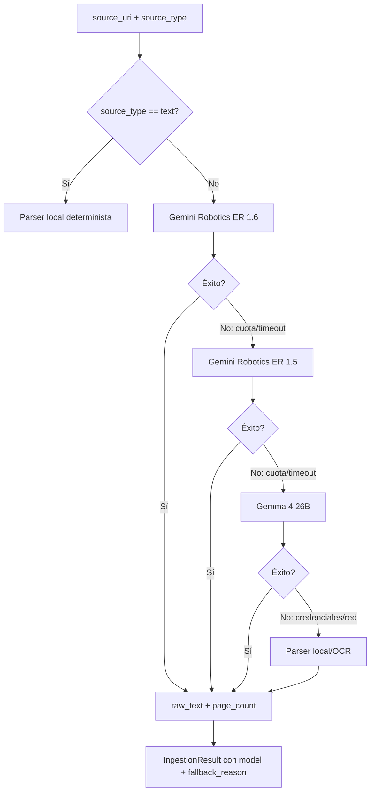
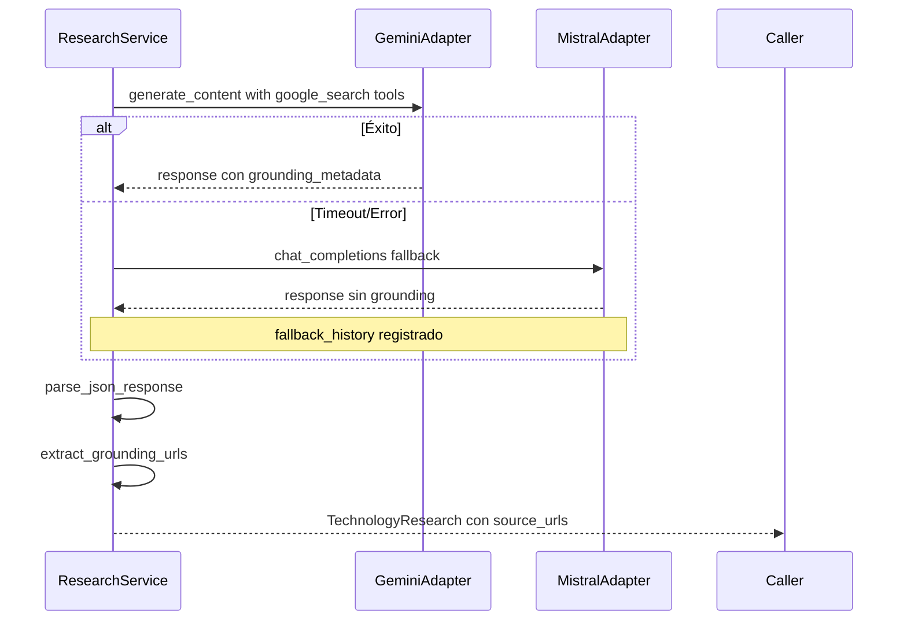

# Integrations Module

## Propósito del Módulo

El módulo `integrations/` encapsula todos los adaptadores hacia proveedores externos de modelos y servicios. Su responsabilidad principal es:

- **Aislamiento de proveedores**: Servicios y workers no conocen detalles de SDKs o URLs
- **Gestión segura de credenciales**: Única capa que lee variables de entorno o `.env`
- **Política de fallbacks**: Cadenas de resiliencia (Gemini 1.6 → 1.5 → Gemma 4)
- **Retry con backoff**: Reintentos automáticos con delays configurables
- **Timeouts explícitos**: Límites de tiempo por operación para evitar bloqueos

Este módulo actúa como frontera entre el dominio interno (servicios, workers) y el mundo externo (APIs de Gemini, Groq, Mistral).

## Interfaz y Contratos

### Inputs

| Adaptador | Input Principal | Configuración |
|-----------|-----------------|---------------|
| `GeminiAdapter` | `prompt: str`, `system_instruction: str`, `generation_config: dict` | `model: str`, `api_key: str`, `base_url: str` |
| `GroqAdapter` | `messages: list[dict]`, `temperature: float` | `model: str`, `api_key: str` |
| `MistralAdapter` | `messages: list[dict]`, `tools: list[dict]` | `model: str`, `api_key: str` |
| `MultimodalDocumentIngestionAdapter` | `source_uri: str`, `source_type: str` | Cadena de fallbacks configurada |

### Outputs

```python
# gemini.py
class GeminiAdapter:
    def generate_content(
        self,
        prompt: str,
        *,
        system_instruction: str | None = None,
        generation_config: dict[str, Any] | None = None,
        tools: list[dict[str, Any]] | None = None,
        timeout: float = 30.0,
    ) -> dict[str, Any]
    
    def embed_content(
        self,
        text: str,
        *,
        timeout: float = 30.0,
    ) -> dict[str, Any]

# groq.py
class GroqAdapter:
    def chat_completions(
        self,
        messages: list[dict[str, Any]],
        *,
        temperature: float = 0.1,
        top_p: float = 1.0,
        max_tokens: int = 4096,
        timeout: float = 60.0,
    ) -> dict[str, Any]

# mistral.py
class MistralAdapter:
    def chat_completions(
        self,
        messages: list[dict[str, Any]],
        *,
        temperature: float = 0.1,
        top_p: float = 1.0,
        max_tokens: int = 4096,
        tools: list[dict[str, Any]] | None = None,
        timeout: float = 60.0,
    ) -> dict[str, Any]
    
    def conversations_start(
        self,
        inputs: list[dict[str, Any]],
        *,
        instructions: str,
        completion_args: dict[str, Any],
        tools: list[dict[str, Any]],
        timeout: float,
    ) -> dict[str, Any]

# document_ingestion.py
class IngestionResult:
    source_type: str
    source_uri: str
    mime_type: str
    raw_text: str
    page_count: int
    ingestion_engine: str  # "gemini" | "local"
    model: str | None
    fallback_reason: str | None
```

## Conexiones y Dependencias

### Hacia Arriba (Quién lo invoca)

| Módulo | Adaptadores Consumidos | Propósito |
|--------|----------------------|-----------|
| `services/extraction.py` | `GeminiAdapter` (Gemma 4 26B) | Extracción de menciones tecnológicas |
| `services/normalization.py` | `GeminiAdapter` (Gemma 4 26B) | Normalización semántica |
| `services/research.py` | `GeminiAdapter`, `MistralAdapter` | Investigación web con fallback |
| `services/planning.py` | `GeminiAdapter` (Gemma 4 31B) | Planificación de research |
| `services/web_search.py` | `GeminiAdapter`, `MistralAdapter` | Búsqueda web por rama |
| `services/synthesizer.py` | `GeminiAdapter` (Gemini 3 Flash) | Síntesis final |
| `services/embedding.py` | `GeminiAdapter` (Gemini Embedding 2) | Embeddings semánticos |
| `workers/document_ingest.py` | `MultimodalDocumentIngestionAdapter` | Ingesta multimodal |

### Hacia Abajo (Qué consume)

| Proveedor | Adaptador | Credencial |
|-----------|-----------|------------|
| Google Gemini API | `GeminiAdapter` | `GEMINI_API_KEY` |
| Groq API | `GroqAdapter` | `GROQ_API_KEY` |
| Mistral API | `MistralAdapter` | `MISTRAL_API_KEY` |

### Boundary de Credenciales

**Regla crítica**: Solo `credentials.py` lee variables de entorno o `.env`.

```python
# integrations/credentials.py (ÚNICO módulo que lee credenciales)
def get_gemini_key(required: bool = True) -> str | None:
    return get_secret("GEMINI_API_KEY", required=required)

def get_groq_key(required: bool = True) -> str | None:
    return get_secret("GROQ_API_KEY", required=required)

def get_mistral_key(required: bool = True) -> str | None:
    return get_secret("MISTRAL_API_KEY", required=required)
```

## Lógica de Resiliencia

### Cadena de Fallback de Ingesta

La ingesta de documentos complejos sigue esta cascada:

```
1. Gemini Robotics ER 1.6 Preview (primario)
   ↓ (falla por cuota, timeout, error de respuesta)
2. Gemini Robotics ER 1.5 Preview (fallback intermedio)
   ↓ (falla por cuota, timeout, error de respuesta)
3. Gemma 4 26B (fallback final LLM)
   ↓ (falla por credenciales, red, respuesta inutilizable)
4. Parser local / OCR (fallback determinista)
```

```python
# integrations/document_ingestion.py
def ingest(self, source_uri: str, source_type: str) -> IngestionResult:
    if source_type == "text":
        return self._ingest_text_local(source_uri)  # Determinista, sin LLM
    
    # Intenta cadena de fallbacks para documentos complejos
    for model_config in self._fallback_chain:
        try:
            return self._ingest_with_model(source_uri, source_type, model_config)
        except Exception as error:
            if not self._is_retryable_error(error):
                raise
            last_error = error
            continue
    
    # Fallback final a parser local
    return self._ingest_local_fallback(source_uri, source_type, last_error)
```

### Fallback de Investigación Web

La investigación web usa fallback entre proveedores por rama:

```python
# services/research.py
def research(self, technology_names: list[str], ...) -> list[TechnologyResearch]:
    for technology_name in technology_names:
        fallback_history = [f"{normalized_name} | primary:{self.model}:grounded"]
        
        try:
            # Intenta Gemini 3.1 Flash Lite con google_search
            response = call_with_retry(
                adapter.generate_content,
                prompt,
                tools=WEB_SEARCH_TOOLS,  # Grounding habilitado
                timeout=120.0,
            )
            payload = self._parse_json_response(response)
        except Exception as error:
            # Fallback a Mistral Small 4
            fallback_history.append(f"{normalized_name} | fallback:{self.fallback_model}:{type(error).__name__}")
            response = call_with_retry(
                self._get_fallback_adapter().chat_completions,
                messages,
                timeout=60.0,
            )
            payload = self._parse_json_response(response)
```

### Retry con Backoff Exponencial

```python
# integrations/retry.py
def call_with_retry(
    func: Callable[..., T],
    *args: Any,
    attempts: int = 3,
    delay_seconds: float = 1.0,
    backoff_factor: float = 2.0,
    **kwargs: Any,
) -> T:
    last_exception: Exception | None = None
    for attempt in range(attempts):
        try:
            return func(*args, **kwargs)
        except Exception as error:
            last_exception = error
            if attempt < attempts - 1:
                sleep(delay_seconds * (backoff_factor ** attempt))
    raise last_exception
```

### Timeouts Explícitos por Modelo

```python
# integrations/model_profiles.py
GEMINI_WEB_SEARCH_TIMEOUT_SECONDS = 120.0  # Investigación con grounding
GEMMA_4_RESEARCH_PLANNER_TIMEOUT_SECONDS = 90.0  # Planificación compleja
MISTRAL_WEB_SEARCH_TIMEOUT_SECONDS = 60.0  # Búsqueda web Mistral
LOCAL_FALLBACK_TIMEOUT_SECONDS = 30.0  # Parser local
```

### Taxonomía de Fallback Reasons

Todos los fallbacks registran `fallback_reason` explícita:

```python
FallbackReason = Literal[
    "timeout",                    # Timeout de proveedor
    "invalid_json",               # JSON mal formado del LLM
    "empty_response",             # Respuesta vacía
    "provider_failure",           # Fallo de proveedor (HTTP 5xx, red)
    "grounded_postprocess",       # Post-proceso de grounding falló
    "planner_fallback",           # Planner no respondió usable
    "gemini_timeout_to_mistral",  # Timeout Gemini → Mistral
    "empty_local_fallback",       # Fallback local vacío
    "invalid_local_fallback",     # Fallback local inválido
]
```

## Flujo de Datos

### Ingesta Documental con Fallbacks



### Investigación Web por Rama



### Llamada Típica desde Servicio

```python
# services/extraction.py (ejemplo de consumo correcto)
from vigilador_tecnologico.integrations import GeminiAdapter
from vigilador_tecnologico.integrations.model_profiles import GEMMA_4_26B_MODEL
from vigilador_tecnologico.integrations.retry import call_with_retry

class ExtractionService:
    def extract_with_context(self, document_id: str, raw_text: str) -> tuple[list[TechnologyMention], dict[str, Any]]:
        adapter = self._get_adapter()  # GeminiAdapter(model=GEMMA_4_26B_MODEL)
        
        started_at = perf_counter()
        try:
            response = call_with_retry(
                adapter.generate_content,
                self._build_prompt(document_id, raw_text),
                attempts=self.retry_attempts,
                delay_seconds=self.retry_delay_seconds,
                system_instruction=self._system_instruction(),
                generation_config={
                    "temperature": 0.0,
                    "responseMimeType": "application/json",
                },
                timeout=self.timeout_seconds,
            )
            # Procesar response...
        except Exception as error:
            # Fallback local determinista...
```

## Estructura de Archivos

```
integrations/
├── __init__.py                  # Re-exports de adaptadores
├── credentials.py               # ÚNICO módulo que lee env/.env
├── document_ingestion.py        # Adaptador multimodal con fallback chain
├── gemini.py                    # Gemini API adapter (generate, embed)
├── groq.py                      # Groq API adapter (chat completions)
├── mistral.py                   # Mistral API adapter (web search, chat)
├── model_profiles.py            # Configuraciones de modelos y timeouts
└── retry.py                     # Utilidad de retry con backoff
```

## Model Profiles (Configuración Centralizada)

```python
# integrations/model_profiles.py

# Ingesta
GEMINI_ROBOTICS_1_6_MODEL = "gemini-robotics-er-1.6-preview"
GEMINI_ROBOTICS_1_5_MODEL = "gemini-robotics-er-1.5-preview"
GEMMA_4_26B_MODEL = "gemma-4-26b-it"

# Investigación
GEMMA_4_RESEARCH_PLANNER_MODEL = "gemma-4-31b-it"
GEMINI_WEB_SEARCH_MODEL = "gemini-3.1-flash-lite-preview"
MISTRAL_WEB_SEARCH_MODEL = "mistral-small-latest"
MISTRAL_REVIEW_MODEL = "mistral-large-latest"

# Síntesis y Embeddings
GEMINI_3_FLASH_MODEL = "gemini-3-flash-preview"
GEMINI_EMBEDDING_MODEL = "gemini-embedding-2"

# Timeouts
GEMINI_WEB_SEARCH_TIMEOUT_SECONDS = 120.0
GEMMA_4_RESEARCH_PLANNER_TIMEOUT_SECONDS = 90.0
MISTRAL_WEB_SEARCH_TIMEOUT_SECONDS = 60.0

# Herramientas
WEB_SEARCH_TOOLS = [{"google_search": {}}]
MISTRAL_WEB_SEARCH_TOOLS = [{"web_search": {}}]
```

## Consideraciones de Diseño

### Por Qué Adaptadores en Lugar de SDKs Directos

1. **Aislamiento de cambios**: Si Google cambia su API, solo se modifica `gemini.py`
2. **Testing**: Adaptadores pueden mockearse fácilmente en tests
3. **Fallbacks**: Lógica de fallback centralizada, no duplicada en servicios
4. **Credenciales**: Solo `credentials.py` conoce variables de entorno

### No God Prompts

Los adaptadores no contienen lógica de negocio ni prompts complejos:

- `GeminiAdapter.generate_content`: Solo construye payload HTTP y maneja transporte
- Los prompts viven en servicios (`extraction.py`, `normalization.py`, etc.)
- El parsing de respuestas también ocurre en servicios

### Determinismo en Ingesta de Texto

La ingesta de texto plano (`source_type="text"`) se resuelve localmente:

```python
def _ingest_text_local(self, source_uri: str) -> IngestionResult:
    # Lee archivo de disco sin llamar a LLM
    raw_text = Path(source_uri).read_text(encoding="utf-8")
    return IngestionResult(
        source_type="text",
        source_uri=source_uri,
        mime_type="text/plain",
        raw_text=raw_text,
        page_count=raw_text.count("\n\n") + 1,  # Estimación determinista
        ingestion_engine="local",
        model=None,
        fallback_reason=None,
    )
```

Esto garantiza:
- **Determinismo**: Mismo input → mismo output siempre
- **Sin gasto de cuota**: Texto plano no consume llamadas LLM
- **Fallback inmediato**: No intenta modelos si es texto plano

## Variables de Entorno

```bash
# .env (cargado automáticamente por credentials.py)
GEMINI_API_KEY=...
GROQ_API_KEY=...
MISTRAL_API_KEY=...
```

El módulo `credentials.py`:
1. Intenta leer de `os.environ` primero
2. Si no encuentra, busca `.env` en directorio actual o padres
3. Carga `.env` y reintenta
4. Lanza `MissingCredentialError` si es `required=True` y no se encuentra

## Tests de Validación

```bash
# Test de adaptador Mistral (fallback path)
python -m unittest tests.test_mistral_adapter

# Test E2E con cadena de fallbacks
python -m unittest tests.test_live_e2e
```
