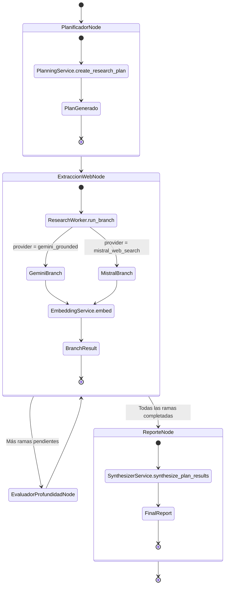

# Pipeline Module

## Propósito del Módulo

El módulo `pipeline/` implementa la **máquina de estados de Deep Research** utilizando LangGraph. Su responsabilidad principal es orquestar el ciclo de investigación web en dos ramas seriales (Gemini grounded y Mistral web search) con control estricto de amplitud (breadth) y profundidad (depth).

Este módulo NO contiene lógica de prompting ni generación de contenido: delega toda la lógica a servicios especializados (`PlanningService`, `SynthesizerService`, `EmbeddingService`) y actúa como coordinador asíncrono de nodos LangGraph.

## Interfaz y Contratos

### Estado de la Máquina de Estados (ResearchState)

```python
class ResearchState(TypedDict):
    # Identificación
    document_id: str                    # Documento asociado (o sintético para chat)
    idempotency_key: str                # Clave de idempotencia
    operation_id: str                   # ID de operación en journal
    
    # Brief de investigación
    raw_query: str                      # Query original del usuario
    query: str                          # Query refinado por PromptEngineering
    target_technology: str              # Tecnología objetivo
    
    # Presupuesto de investigación
    breadth: int                        # Queries únicas por ronda (default: 3)
    depth: int                          # Profundidad máxima (default: 1-2)
    current_depth: int                  # Profundidad actual alcanzada
    iteration: int                      # Iteración actual
    
    # Cursor de rama serial
    branch_cursor: int                  # Índice de rama actual (0 o 1)
    
    # Acumuladores (operator.add para merges)
    learnings: Annotated[list[str], operator.add]       # Aprendizajes acumulados
    visited_urls: Annotated[list[str], operator.add]    # URLs visitadas
    embeddings: Annotated[list[EmbeddingArtifact], operator.add]  # Embeddings
    branch_results: Annotated[list[ResearchBranchResult], operator.add]  # Resultados por rama
    
    # Estado de ejecución
    queries_to_run: list[str]           # Queries pendientes para la rama actual
    executed_queries: list[str]         # Queries ya ejecutadas
    final_report: str | None            # Reporte final consolidado
    research_plan: ResearchPlan | None  # Plan generado por PlanningService
```

### Inputs por Nodo

| Nodo | Input (ResearchState) | Output (dict) |
|------|----------------------|---------------|
| `planificador_node` | `target_technology`, `query`, `breadth`, `depth` | `research_plan`, `branch_cursor=0`, `queries_to_run` |
| `extraccion_web_node` | `research_plan`, `branch_cursor`, `queries_to_run` | `branch_results`, `learnings`, `visited_urls`, `embeddings` |
| `evaluador_profundidad_node` | `research_plan`, `branch_cursor`, `current_depth` | `branch_cursor+1`, `queries_to_run` (siguiente rama) |
| `reporte_node` | `research_plan`, `branch_results`, `target_technology` | `final_report`, `stage_context` |

### Outputs (ResearchBranchResult)

```python
class ResearchBranchResult(TypedDict):
    branch_id: str                      # "gemini-grounded" o "mistral-web"
    provider: ResearchBranchProvider    # "gemini_grounded" | "mistral_web_search"
    objective: str                      # Objetivo de la rama
    search_model: str                   # Modelo de búsqueda usado
    review_model: str                   # Modelo de revisión usado
    executed_queries: list[str]         # Queries ejecutadas
    learnings: list[str]                # Aprendizajes obtenidos
    source_urls: list[str]              # URLs de fuentes
    iterations: int                     # Iteraciones completadas
    embeddings: list[EmbeddingArtifact] # Embeddings generados
```

## Conexiones y Dependencias

### Hacia Arriba (Quién lo invoca)

| Módulo | Función Consumida | Propósito |
|--------|------------------|-----------|
| `workers/research.py` | `ResearchWorker.run_branch()` | Ejecuta rama específica del plan |
| `workers/orchestrator.py` | `PipelineOrchestrator.run_document()` | Orquesta pipeline completo |
| `api/_research_operations.py` | `build_research_graph()` | Crea grafo para operación de research |

### Hacia Abajo (Qué consume)

| Servicio | Nodo que lo consume | Propósito |
|----------|-------------------|-----------|
| `PlanningService` | `planificador_node` | Crear plan de investigación con Gemma 4 31B |
| `ResearchWorker` | `extraccion_web_node` | Ejecutar búsqueda web por rama |
| `EmbeddingService` | `ResearchWorker` (interno) | Generar embeddings después de cada iteración |
| `SynthesizerService` | `reporte_node` | Consolidar resultados finales con Gemini 3 Flash |

## Lógica de Resiliencia

### Ejecución Serial (No Concurrente)

**Regla crítica**: Las ramas se ejecutan en secuencia, sin llamadas concurrentes entre modelos.

```python
# pipeline/graph_orchestrator.py
def build_research_graph() -> StateGraph:
    workflow = StateGraph(ResearchState)
    workflow.add_node("planificador_node", planificador_node)
    workflow.add_node("extraccion_web_node", extraccion_web_node)
    workflow.add_node("evaluador_profundidad_node", evaluador_profundidad_node)
    workflow.add_node("reporte_node", reporte_node)
    
    workflow.add_edge(START, "planificador_node")
    workflow.add_edge("planificador_node", "extraccion_web_node")
    workflow.add_conditional_edges("extraccion_web_node", router_profundidad)
    workflow.add_edge("evaluador_profundidad_node", "extraccion_web_node")
    workflow.add_edge("reporte_node", END)
    
    return workflow.compile()

def router_profundidad(state: ResearchState) -> Literal["evaluador_profundidad_node", "reporte_node"]:
    # Decide si continúa a siguiente rama o termina
    branches = research_plan.get("branches")
    branch_cursor = state.get("branch_cursor", 0)
    
    if branch_cursor + 1 >= len(branches):
        return "reporte_node"  # Todas las ramas completadas → síntesis
    return "evaluador_profundidad_node"  # Avanza a siguiente rama
```

### Validación de JSON Antes de Avanzar

El grafo NO avanza si una respuesta no valida su JSON:

```python
# pipeline/nodes.py (extraccion_web_node)
async def extraccion_web_node(state: ResearchState) -> dict[str, Any]:
    branch = _current_branch(state)
    
    # ResearchWorker valida JSON internamente
    execution = await web_research_worker.run_branch(
        branch,
        target_technology=state["target_technology"],
        research_brief=state["query"],
        breadth=state.get("breadth", 3),
        depth=state.get("depth", 2),
    )
    
    # Si llegamos aquí, JSON fue validado
    branch_result = execution.branch_result
    return {
        "branch_results": [branch_result],
        "learnings": branch_result["learnings"],
        # ...
    }
```

### Límites Rígidos de Breadth/Depth

Cada iteración del planner produce como máximo `breadth` queries únicas:

```python
# pipeline/nodes.py (planificador_node)
async def planificador_node(state: ResearchState) -> dict[str, Any]:
    plan, stage_context = await asyncio.to_thread(
        planning_service.create_research_plan,
        state["target_technology"],
        state["query"],
        state.get("breadth", 3),  # Límite explícito
        state.get("depth", 2),
    )
    
    first_branch = plan["branches"][0]
    return {
        "research_plan": plan,
        "branch_cursor": 0,
        "queries_to_run": list(first_branch["queries"]),  # Máximo = breadth
        "iteration": 1,
    }
```

`depth` solo avanza al cerrar cada extracción web:

```python
# pipeline/nodes.py (extraccion_web_node)
async def extraccion_web_node(state: ResearchState) -> dict[str, Any]:
    # ...
    return {
        # ...
        "current_depth": state.get("current_depth", 0) + 1,  # Incrementa solo al cerrar
        "iteration": branch_result["iterations"] or 1,
    }
```

### StageContext Enriquecido

Todos los nodos enriquecen `stage_context` con metadatos consistentes:

```python
# pipeline/nodes.py
def _enrich_stage_context(
    stage_context: dict[str, Any],
    state: ResearchState,
    *,
    current_depth: int,
    iteration: int,
    query_count: int | None = None,
    branch: ResearchPlanBranch | None = None,
    embedding_count: int | None = None,
) -> dict[str, Any]:
    return build_stage_context(
        str(_stage_value(stage_context, "stage") or "research-node"),
        model=str(model) if isinstance(model, str) and model.strip() else None,
        duration_ms=_stage_value(stage_context, "duration_ms"),
        fallback_reason=_stage_value(stage_context, "fallback_reason"),
        node_name=_stage_value(stage_context, "node_name"),
        breadth=state.get("breadth", 3),
        depth=state.get("depth", 1),
        current_depth=current_depth,
        iteration=iteration,
        document_id=state.get("document_id", ""),
        target_technology=state.get("target_technology", ""),
        query_count=query_count,
        plan_id=_stage_value(stage_context, "plan_id"),
        branch_id=branch.get("branch_id") if branch else None,
        branch_provider=branch.get("provider") if branch else None,
        embedding_count=embedding_count,
    )
```

## Flujo de Datos

### Máquina de Estados Completa



### Secuencia de Ejecución Serial

```
1. START
   ↓
2. planificador_node
   - PlanningService.create_research_plan (Gemma 4 31B)
   - Genera 2 ramas: gemini-grounded, mistral-web
   ↓
3. extraccion_web_node (rama 0: gemini-grounded)
   - ResearchWorker.run_branch
   - Gemini 3.1 Flash Lite con google_search
   - Gemma 4 26B para revisión
   - Gemini Embedding 2 para embeddings
   ↓
4. evaluador_profundidad_node
   - branch_cursor: 0 → 1
   - queries_to_run: segunda rama
   ↓
5. extraccion_web_node (rama 1: mistral-web)
   - ResearchWorker.run_branch
   - Mistral Small 4 con web_search
   - Mistral Large Latest para revisión
   - Gemini Embedding 2 para embeddings
   ↓
6. evaluador_profundidad_node
   - branch_cursor: 1 → 2 (fin de ramas)
   ↓
7. reporte_node
   - SynthesizerService.synthesize_plan_results (Gemini 3 Flash Preview)
   ↓
8. END
```

### ResearchState Evolution

```
Estado inicial:
{
  "target_technology": "FastAPI",
  "query": "FastAPI performance and alternatives",
  "breadth": 3,
  "depth": 2,
  "branch_cursor": 0,
  "learnings": [],
  "visited_urls": [],
  "embeddings": [],
  "branch_results": [],
  "queries_to_run": [],
  "executed_queries": [],
  "final_report": null,
  "research_plan": null
}

Después de planificador_node:
{
  ...
  "research_plan": {
    "plan_id": "abc123",
    "branches": [
      {"branch_id": "gemini-grounded", "queries": ["q1", "q2", "q3"]},
      {"branch_id": "mistral-web", "queries": ["q4", "q5", "q6"]}
    ]
  },
  "branch_cursor": 0,
  "queries_to_run": ["q1", "q2", "q3"],
  "iteration": 1
}

Después de extraccion_web_node (rama 0):
{
  ...
  "branch_results": [{branch_id: "gemini-grounded", learnings: [...], ...}],
  "learnings": ["learning1", "learning2", ...],
  "visited_urls": ["url1", "url2", ...],
  "embeddings": [{embedding_id: "...", ...}],
  "current_depth": 1,
  "executed_queries": ["q1", "q2", "q3"]
}

Después de evaluador_profundidad_node:
{
  ...
  "branch_cursor": 1,
  "queries_to_run": ["q4", "q5", "q6"]
}

Después de extraccion_web_node (rama 1):
{
  ...
  "branch_results": [rama0, rama1],
  "learnings": [...],  # Acumulados de ambas ramas
  "visited_urls": [...],  # Acumulados
  "embeddings": [...],  # Acumulados
}

Después de reporte_node:
{
  ...
  "final_report": "# Research Report\n\n..."
}
```

## Estructura de Archivos

```
pipeline/
├── __init__.py                  # Re-exports
├── graph_orchestrator.py        # Construcción de LangGraph StateGraph
├── nodes.py                     # Nodos LangGraph (delegan a servicios)
└── state.py                     # ResearchState TypedDict
```

### graph_orchestrator.py

Construye la máquina de estados LangGraph con:
- 4 nodos: `planificador`, `extraccion_web`, `evaluador_profundidad`, `reporte`
- 1 router condicional: `router_profundidad`
- Bucle: `extraccion_web` → `evaluador` → `extraccion_web` (siguiente rama)

### nodes.py

Nodos LangGraph que delegan lógica a servicios:

| Nodo | Servicio Delegado | Modelo |
|------|------------------|--------|
| `planificador_node` | `PlanningService.create_research_plan` | Gemma 4 31B |
| `extraccion_web_node` | `ResearchWorker.run_branch` | Gemini 3.1 Flash Lite / Mistral Small 4 |
| `evaluador_profundidad_node` | (lógica interna) | N/A |
| `reporte_node` | `SynthesizerService.synthesize_plan_results` | Gemini 3 Flash Preview |

### state.py

Define `ResearchState` como `TypedDict` con:
- Campos requeridos para identificación y brief
- Campos `Annotated[list, operator.add]` para acumuladores mergeables
- Campos opcionales para estado de ejecución

## Consideraciones de Diseño

### Por Qué LangGraph en Lugar de Bucles Manuales

1. **Estado explícito**: `ResearchState` documenta todo el estado de la investigación
2. **Trazabilidad**: Cada transición de nodo queda registrada en el journal
3. **Recuperación**: El estado puede persistirse y reanudarse
4. **Testing**: Nodos individuales pueden testearse en aislamiento

### Nodos Delgados, Servicios Gruesos

Los nodos NO contienen lógica de negocio:

```python
# CORRECTO: Nodo delgado
async def planificador_node(state: ResearchState) -> dict[str, Any]:
    plan, stage_context = await asyncio.to_thread(
        planning_service.create_research_plan,  # Lógica en servicio
        state["target_technology"],
        state["query"],
        state.get("breadth", 3),
        state.get("depth", 2),
    )
    return {"research_plan": plan, "stage_context": stage_context}

# INCORRECTO: Nodo con lógica (NO hacer)
async def planificador_node(state: ResearchState) -> dict[str, Any]:
    # NO poner prompts, parsing o lógica de negocio aquí
    prompt = f"Create research plan for {state['target_technology']}..."
    response = await adapter.generate_content(prompt)
    # ...
```

### No Introspección de Firma de Servicio

El pipeline documental usa contrato explícito `breadth=3`, `depth=1`:

```python
# workers/orchestrator.py (NO usar introspección)
research_results = research_service.research(
    technology_names,
    breadth=3,  # Explícito, NO getattr(research_service, 'breadth', ...)
    depth=1,    # Explícito, NO inspect.signature(...)
)
```

### Serial vs Concurrente

Las ramas se ejecutan **en secuencia** por diseño:

- **Ventaja**: Control preciso de cuota, debugging más simple, embeddings después de cada rama validada
- **Desventaja**: Más lento que ejecución paralela (aceptable para v1)

Si se requiere paralelismo futuro, se puede:
1. Agregar modo `execution_mode: Literal["serial", "parallel"]` en `ResearchPlan`
2. Usar `asyncio.gather` en `orchestrator.py` para ramas independientes
3. Mantener serial como default para determinismo

## Contrato de Investigación para Pipeline Documental

El pipeline de documentos usa un contrato fijo:

```python
# workers/orchestrator.py
research_results = research_service.research(
    technology_names,
    breadth=3,  # Fijo para documentos
    depth=1,    # Fijo para documentos
)
```

Esto garantiza:
- **Predictibilidad**: Mismo documento → misma investigación
- **Control de costo**: Máximo 3 queries por rama, 1 iteración
- **Sin introspección**: No depende de firma de servicio que pueda cambiar
