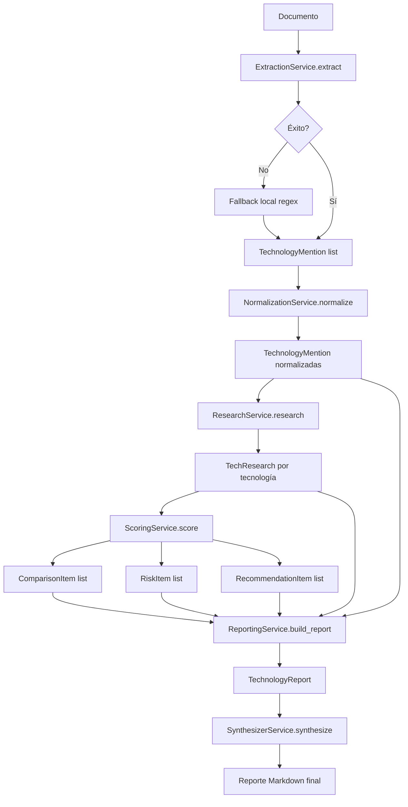
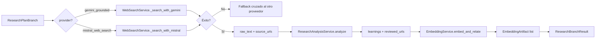

# Services Module

## Propósito del Módulo

El módulo `services/` contiene la **lógica de negocio central** del sistema Vigilador Tecnológico. Implementa los servicios de:

- **Extracción**: Detección de menciones tecnológicas en documentos
- **Normalización**: Unificación semántica de menciones duplicadas
- **Investigación**: Búsqueda web con grounding y fallback entre proveedores
- **Planificación**: Generación de planes de research con Gemma 4 31B
- **Scoring**: Comparación de mercado, evaluación de riesgos y recomendaciones
- **Reporte**: Consolidación de inventario tecnológico y fuentes
- **Síntesis**: Generación de reporte final con Gemini 3 Flash Preview
- **Embeddings**: Relaciones semánticas entre learnings
- **Notificación**: Alertas críticas y fallos operativos

Cada servicio es **determinista por defecto** y solo usa modelos cuando es explícitamente documentado. Los servicios exponen dos APIs: `method()` simple y `method_with_context()` que retorna `(resultado, stage_context)` para trazabilidad SSE.

## Interfaz y Contratos

### ExtractionService

**Propósito**: Extraer menciones tecnológicas de texto documental.

```python
class ExtractionService:
    def extract(
        self,
        document_id: str,
        source_type: str,
        source_uri: str,
        raw_text: str,
    ) -> list[TechnologyMention]
    
    def extract_with_context(
        self,
        document_id: str,
        source_type: str,
        source_uri: str,
        raw_text: str,
    ) -> tuple[list[TechnologyMention], dict[str, Any]]
```

**Modelo**: Gemma 4 26B (fallback: parser local determinista)

**Fallback**: Si Gemma 4 falla (timeout, JSON inválido, empty response), usa patrones regex locales para detectar tecnologías conocidas (FastAPI, PostgreSQL, Docker, etc.).

```python
# services/extraction.py
LOCAL_TECH_PATTERNS = (
    ("FastAPI", "framework", re.compile(r"\bfastapi\b", re.IGNORECASE)),
    ("PostgreSQL", "database", re.compile(r"\bpostgres(?:ql)?\b", re.IGNORECASE)),
    ("Docker", "tool", re.compile(r"\bdocker\b", re.IGNORECASE)),
    # ... 30+ patrones predefinidos
)
```

### NormalizationService

**Propósito**: Normalizar menciones duplicadas a identificadores canónicos estables.

```python
class NormalizationService:
    def normalize(
        self,
        mentions: list[TechnologyMention],
    ) -> list[TechnologyMention]
    
    def normalize_with_context(
        self,
        mentions: list[TechnologyMention],
    ) -> tuple[list[TechnologyMention], dict[str, Any]]
```

**Modelo**: Gemma 4 26B

**Fallback**: Sanitización local que preserva `mention_id`, `document_id`, y evidencia original.

### ResearchService

**Propósito**: Investigar tecnologías en la web con grounding y fallback Gemini → Mistral.

```python
class ResearchService:
    def research(
        self,
        technology_names: list[str],
        *,
        breadth: int | None = None,
        depth: int | None = None,
        progress_callback: ResearchProgressCallback | None = None,
    ) -> list[TechnologyResearch]
```

**Modelos**:
- Primario: Gemini 3.1 Flash Lite con `google_search` grounding
- Fallback: Mistral Small 4 con `web_search` tool

**Fallback History**: Cada tecnología investiga registra su historial:

```python
fallback_history = [
    "FastAPI | primary:gemini-3.1-flash-lite-preview:grounded",
    "FastAPI | fallback:mistral-small-latest:TimeoutError",
]
```

### PlanningService

**Propósito**: Generar plan de investigación con queries para dos ramas seriales.

```python
class PlanningService:
    def create_research_plan(
        self,
        target_technology: str,
        research_brief: str,
        breadth: int = 3,
        depth: int = 2,
    ) -> tuple[ResearchPlan, dict[str, Any]]
```

**Modelo**: Gemma 4 31B

**Fallback**: Plan determinista con seed queries predefinidas:

```python
# services/planning.py
def _deterministic_plan_fallback(self, ...) -> ResearchPlan:
    gemini_queries = self._seed_queries(target_technology, research_brief, "gemini", breadth)
    mistral_queries = self._seed_queries(target_technology, research_brief, "mistral", breadth)
    # Retorna plan con 2 ramas y queries seed
```

### WebSearchService

**Propósito**: Ejecutar búsqueda web por rama (gemini_grounded o mistral_web_search).

```python
class WebSearchService:
    async def search_branch(
        self,
        branch: ResearchPlanBranch,
        *,
        query: str,
        target_technology: str,
    ) -> dict[str, Any]
```

**Modelos por rama**:
- `gemini_grounded`: Gemini 3.1 Flash Lite + Google Search grounding
- `mistral_web_search`: Mistral Small 4 + web_search tool

**Fallback cruzado**: Si Gemini falla, intenta Mistral automáticamente:

```python
# services/web_search.py
async def _search_with_gemini(self, query: str, target_technology: str) -> dict[str, Any]:
    try:
        response = await asyncio.to_thread(
            call_with_retry,
            self.gemini_adapter.generate_content,
            prompt,
            tools=WEB_SEARCH_TOOLS,
            timeout=search_timeout,
        )
        text = extract_response_text(response).strip()
        source_urls = extract_grounding_urls(response)
        return {"raw_text": text, "source_urls": source_urls}
    except Exception as error:
        # Fallback automático a Mistral
        mistral_output = await self._search_with_mistral(query, target_technology)
        mistral_output["fallback_provider"] = "mistral_web_search"
        mistral_output["fallback_error"] = str(error)
        return mistral_output
```

### ScoringService

**Propósito**: Comparar menciones internas con investigación externa y generar riesgos/recomendaciones.

```python
class ScoringService:
    def score(
        self,
        mentions: list[TechnologyMention],
        research_results: list[TechnologyResearch],
    ) -> tuple[list[ComparisonItem], list[RiskItem], list[RecommendationItem]]
```

**Determinista**: No usa modelos. Aplica reglas deterministas:

```python
# services/scoring.py
def _risk_severity(self, market_status: ResearchStatus, version_gap: str | None, mention_count: int) -> SeverityLevel:
    if market_status == "deprecated":
        return "critical"
    if market_status == "unknown":
        return "high" if mention_count > 1 else "medium"
    if market_status == "emerging":
        return "medium"
    if version_gap is not None:
        return "medium"
    return "low"
```

### ReportingService

**Propósito**: Consolidar reporte final con inventario, comparaciones, riesgos y fuentes.

```python
class ReportingService:
    def build_report(
        self,
        report_id: str,
        document_scope: list[DocumentScopeItem],
        executive_summary: str,
        mentions: list[TechnologyMention],
        research_results: list[TechnologyResearch],
        comparisons: list[ComparisonItem],
        risks: list[RiskItem],
        recommendations: list[RecommendationItem],
        sources: list[SourceItem],
    ) -> TechnologyReport
```

**Determinista**: Ensambla reporte a partir de inputs sin modelos.

### SynthesizerService

**Propósito**: Generar reporte Markdown final consolidando resultados de ramas.

```python
class SynthesizerService:
    def synthesize_plan_results(
        self,
        target_technology: str,
        plan: ResearchPlan,
        branch_results: list[ResearchBranchResult],
    ) -> tuple[str, dict[str, Any]]
```

**Modelo**: Gemini 3 Flash Preview

### EmbeddingService

**Propósito**: Generar embeddings y relaciones semánticas entre learnings.

```python
class EmbeddingService:
    def embed_and_relate(
        self,
        texts: list[str],
        branch_id: str,
        iteration: int,
        query: str,
    ) -> list[EmbeddingArtifact]
```

**Modelo**: Gemini Embedding 2

### NotificationService

**Propósito**: Registrar alertas críticas y fallos operativos en audit log.

```python
class NotificationService:
    def notify_critical_risks(
        self,
        storage_service: StorageService,
        document_id: str,
        report_id: str,
        risks: list[RiskItem],
    ) -> None
    
    def notify_operation_failure(
        self,
        storage_service: StorageService,
        document_id: str,
        operation_id: str,
        error: str,
        details: dict[str, Any],
    ) -> None
```

**Determinista**: Solo persiste eventos en audit log.

## Conexiones y Dependencias

### Hacia Arriba (Quién lo invoca)

| Servicio | Consumidores |
|----------|-------------|
| `ExtractionService` | `workers/orchestrator.py`, `api/documents.py` |
| `NormalizationService` | `workers/orchestrator.py` |
| `ResearchService` | `workers/research.py` |
| `PlanningService` | `pipeline/nodes.py` (planificador_node) |
| `WebSearchService` | `workers/research.py` |
| `ScoringService` | `workers/orchestrator.py` |
| `ReportingService` | `workers/orchestrator.py` |
| `SynthesizerService` | `pipeline/nodes.py` (reporte_node) |
| `EmbeddingService` | `workers/research.py` |
| `NotificationService` | `workers/analysis.py`, `api/documents.py` |

### Hacia Abajo (Qué consume)

| Servicio | Adaptadores/Integrations |
|----------|-------------------------|
| `ExtractionService` | `GeminiAdapter` (Gemma 4 26B) |
| `NormalizationService` | `GeminiAdapter` (Gemma 4 26B) |
| `ResearchService` | `GeminiAdapter`, `MistralAdapter` |
| `PlanningService` | `GeminiAdapter` (Gemma 4 31B) |
| `WebSearchService` | `GeminiAdapter`, `MistralAdapter` |
| `SynthesizerService` | `GeminiAdapter` (Gemini 3 Flash) |
| `EmbeddingService` | `GeminiAdapter` (Gemini Embedding 2) |
| `NotificationService` | `StorageService.audit` |

## Lógica de Resiliencia

### Fallback Explícito con Taxonomía

Todos los servicios registran `fallback_reason` explícita:

```python
# services/_fallback.py
FallbackReason = Literal[
    "timeout",
    "invalid_json",
    "empty_response",
    "provider_failure",
    "grounded_postprocess",
    "planner_fallback",
    "gemini_timeout_to_mistral",
    "empty_local_fallback",
    "invalid_local_fallback",
]

def fallback_reason_from_error(error: Exception, *, grounded_postprocess: bool = False) -> FallbackReason:
    if grounded_postprocess:
        return "grounded_postprocess"
    if isinstance(error, TimeoutError):
        return "timeout"
    if isinstance(error, ResponsePayloadError):
        if "invalid JSON" in str(error):
            return "invalid_json"
        if "empty" in str(error).lower():
            return "empty_response"
    return "provider_failure"
```

### No Fallbacks Silenciosos

Los servicios NO fingen que un modelo respondió cuando usaron fallback:

```python
# services/extraction.py
try:
    response = call_with_retry(adapter.generate_content, ...)
    payload = self._parse_json_response(response)
    if not payload.get("mentions"):
        raise ResponsePayloadError("Gemini extraction response did not contain usable mentions.")
except Exception as error:
    if should_propagate_error(error) or not is_expected_fallback_error(error):
        raise  # Propaga errores no esperados
    
    # Fallback local EXPLÍCITO
    local_mentions = self._local_extract_mentions(...)
    if local_mentions:
        logger.warning("extraction_fallback_to_local", extra={"error": str(error), "mention_count": len(local_mentions)})
        return local_mentions, build_stage_context(..., fallback_reason=fallback_reason_from_error(error))
    
    logger.warning("extraction_fallback_empty", extra={"error": str(error)})
    return [], build_stage_context(..., fallback_reason=LOCAL_FALLBACK_EMPTY_REASON)
```

### Detección de Prompt Echo

Los servicios detectan cuando el modelo devuelve el prompt en lugar de la respuesta:

```python
# services/normalization.py
_PROMPT_ECHO_PATTERNS = (
    re.compile(r"(^|\n)\s*input\s*:", re.IGNORECASE),
    re.compile(r"(^|\n)\s*task\s*:", re.IGNORECASE),
    re.compile(r"(^|\n)\s*constraints\s*:", re.IGNORECASE),
    re.compile(r"(^|\n)\s*self-correction\s*:", re.IGNORECASE),
)

def _looks_like_prompt_echo(self, text: str) -> bool:
    if not text.lstrip().startswith(("{", "[")):
        return any(pattern.search(text) for pattern in _PROMPT_ECHO_PATTERNS)
    return False
```

### Validación de JSON Antes de Usar

Todas las respuestas LLM que se consumen como JSON se validan explícitamente:

```python
# services/_llm_response.py
def parse_json_response(
    response: dict[str, Any],
    *,
    invalid_json_error: str,
    invalid_shape_error: str,
    empty_result: Any,
) -> Any:
    text = extract_response_text(response).strip()
    if not text:
        raise ResponsePayloadError("Response is empty.")
    
    # Intenta parsear JSON
    try:
        parsed = json.loads(text)
    except json.JSONDecodeError as error:
        raise ResponsePayloadError(invalid_json_error) from error
    
    # Valida forma (dict o list)
    if not isinstance(parsed, (dict, list)):
        raise ResponsePayloadError(invalid_shape_error)
    
    return parsed
```

### StageContext Centralizado

Todos los servicios usan `build_stage_context()` para metadatos consistentes:

```python
# services/_stage_context.py
def build_stage_context(
    stage: str,
    model: str | None = None,
    fallback_reason: FallbackReason | None = None,
    duration_ms: int | None = None,
    **extra: Any,
) -> StageContext:
    context: StageContext = {"stage": stage}
    if model:
        context["model"] = model
    if fallback_reason:
        context["fallback_reason"] = fallback_reason
    if duration_ms is not None:
        context["duration_ms"] = duration_ms
    context.update(extra)
    return context
```

## Flujo de Datos

### Pipeline Completo (Extracción → Reporte)



### Investigación por Rama



### Scoring Determinista

```
mentions (TechnologyMention[])
    ↓
group_by(normalized_name)
    ↓
MentionGroup { representative, mentions[], evidence_ids[], source_urls[] }
    ↓
index_research(research_results) → { technology_name: TechnologyResearch }
    ↓
Para cada MentionGroup:
  - build_comparison(group, research) → ComparisonItem
  - build_risk(group, research) → RiskItem
  - build_recommendation(group, research) → RecommendationItem
    ↓
(comparisons[], risks[], recommendations[])
```

## Estructura de Archivos

```
services/
├── __init__.py                  # Re-exports
├── _fallback.py                 # Taxonomía de fallbacks, utilidades
├── _llm_response.py             # Parsing de respuestas LLM (JSON, text extraction)
├── _stage_context.py            # build_stage_context() centralizado
├── _text_utils.py               # Utilidades de texto (normalize, deduplicate)
├── embedding.py                 # EmbeddingService
├── extraction.py                # ExtractionService
├── normalization.py             # NormalizationService
├── notification.py              # NotificationService
├── planning.py                  # PlanningService
├── prompt_engineering.py        # PromptEngineeringService (tool-free query refinement)
├── reporting.py                 # ReportingService + render_report_markdown()
├── research.py                  # ResearchService
├── research_analysis.py         # ResearchAnalysisService (review por rama)
├── scoring.py                   # ScoringService
├── synthesizer.py               # SynthesizerService
└── web_search.py                # WebSearchService
```

## Servicios Auxiliares

### PromptEngineeringService

Refina query de investigación sin usar herramientas web:

```python
class PromptEngineeringService:
    def refine_query(
        self,
        query: str,
        target_technology: str,
    ) -> tuple[str, dict[str, Any]]
```

**Modelo**: Gemma 4 26B

**Fallback**: Brief determinista si el modelo falla:

```python
# services/prompt_engineering.py
def _deterministic_brief_fallback(self, query: str, target_technology: str) -> str:
    return f"Investigate {target_technology}: {query}"
```

### ResearchAnalysisService

Revisa y analiza resultados de búsqueda web por rama:

```python
class ResearchAnalysisService:
    def analyze(
        self,
        branch_id: str,
        provider: ResearchBranchProvider,
        raw_text: str,
        source_urls: list[str],
    ) -> tuple[list[str], list[str]]  # (learnings, reviewed_urls)
```

**Modelos**:
- Rama Gemini: Gemma 4 26B
- Rama Mistral: Mistral Large Latest

## Consideraciones de Diseño

### Servicios con Contexto (`_with_context`)

Todos los servicios exponen API dual:

```python
# Patrón consistente en todos los servicios
class ExtractionService:
    def extract(self, ...) -> list[TechnologyMention]:
        mentions, _ = self.extract_with_context(...)
        return mentions
    
    def extract_with_context(self, ...) -> tuple[list[TechnologyMention], dict[str, Any]]:
        # Lógica real que retorna stage_context
```

Esto permite:
- **Simplicidad**: `extract()` para uso directo
- **Trazabilidad**: `extract_with_context()` para SSE y audit log

### No God Prompts

Los servicios extraen learnings limitados antes de pasar al siguiente nodo:

```python
# services/research_analysis.py
# NO devolver todo el texto crudo
# Solo learnings concisos (2-4 items)
learnings = self._extract_key_learnings(text, max_learnings=4)
return learnings, reviewed_urls
```

### Determinismo por Defecto

Servicios que NO usan modelos:

- `ScoringService`: Reglas deterministas para riesgos/recomendaciones
- `ReportingService`: Ensamblaje de reporte sin generación LLM
- `NotificationService`: Persistencia en audit log

### Separación de Responsabilidades

| Capa | Responsabilidad | Ejemplo |
|------|----------------|---------|
| `integrations/` | Transporte HTTP, credenciales | `GeminiAdapter.generate_content()` |
| `services/` | Lógica de negocio, prompts, parsing | `ExtractionService.extract_with_context()` |
| `pipeline/` | Orquestación de estado | `planificador_node` |
| `workers/` | Ejecución de pipeline | `execute_analysis_operation()` |

## Tests de Validación

```bash
# Test E2E con todos los servicios
python -m unittest tests.test_live_e2e

# Test de adaptación Mistral (fallback path)
python -m unittest tests.test_mistral_adapter

# Test de endpoints operativos (scoring, reporting)
python -m unittest tests.test_operational_endpoints tests.test_document_analyze
```
