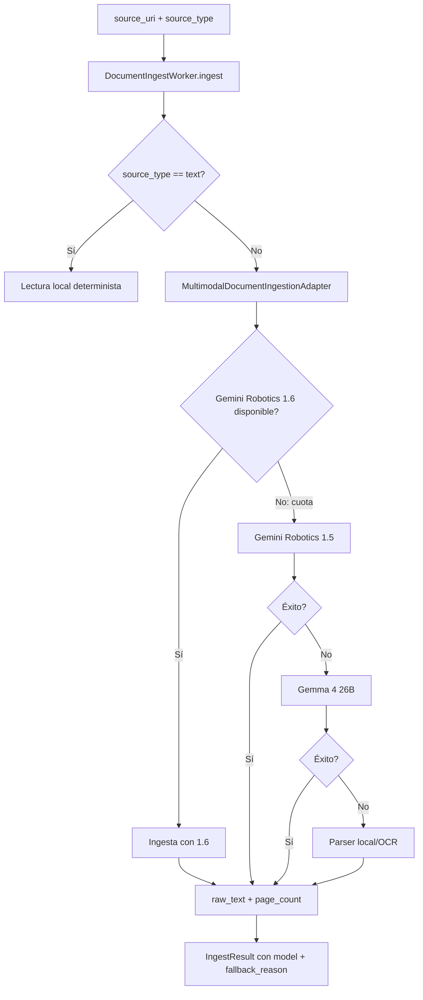

# Workers Module

## Propósito del Módulo

El módulo `workers/` implementa los **procesos de ejecución en segundo plano** del sistema Vigilador Tecnológico. Los workers son responsables de:

- **Ingesta documental**: Parseo de PDFs, imágenes y documentos Office
- **Orquestación de pipeline**: Ejecución secuencial de extracción → normalización → investigación → scoring → reporte
- **Investigación web**: Ejecución de ramas de research con LangGraph
- **Notificaciones**: Alertas de fallos operativos y riesgos críticos

Los workers actúan como capa de ejecución que consume servicios y persiste resultados via storage, sin exponer endpoints HTTP directamente (esa responsabilidad es de `api/`).

## Interfaz y Contratos

### DocumentIngestWorker

**Propósito**: Ingestar documentos multimodales (PDF, imágenes, Office, texto plano).

```python
class DocumentIngestWorker:
    def __init__(self, adapter: object | None = None) -> None:
        self.adapter = adapter or MultimodalDocumentIngestionAdapter()
    
    def ingest(
        self,
        source_uri: str,
        source_type: str,
        document_id: str,
    ) -> IngestResult
```

**IngestResult**:

```python
@dataclass(slots=True)
class IngestResult:
    document_id: str
    source_type: str
    source_uri: str
    mime_type: str
    raw_text: str
    page_count: int
    ingestion_engine: str = "local"  # "gemini" o "local"
    model: str | None = None
    fallback_reason: str | None = None
```

### PipelineOrchestrator

**Propósito**: Orquestar el pipeline completo de análisis documental.

```python
class PipelineOrchestrator:
    def run_document(
        self,
        stored_document: StoredDocument,
        parsed_document: ParsedDocumentRecord,
        document_storage: DocumentStorage,
        storage_service: StorageService,
        record_event: Callable[[str, dict[str, object], str | None], None],
    ) -> PipelineResult
```

**PipelineResult**:

```python
@dataclass(slots=True)
class PipelineResult:
    report_id: str
    report: TechnologyReport
    normalized_mentions: list[TechnologyMention]
    research_results: list[TechnologyResearch]
    risks: list[RiskItem]
```

### ResearchWorker

**Propósito**: Ejecutar investigación web por rama (LangGraph worker).

```python
class ResearchWorker:
    def __init__(
        self,
        embedding_service: EmbeddingService | None = None,
        web_search_service: WebSearchService | None = None,
        research_analysis_service: ResearchAnalysisService | None = None,
    ) -> None:
        self.embedding_service = embedding_service or EmbeddingService()
        self.web_search_service = web_search_service or WebSearchService(...)
        self.research_analysis_service = research_analysis_service or ResearchAnalysisService(...)
    
    async def run_branch(
        self,
        branch: ResearchPlanBranch,
        *,
        target_technology: str,
        research_brief: str,
        breadth: int,
        depth: int,
    ) -> BranchExecutionResult
```

**BranchExecutionResult**:

```python
@dataclass(slots=True)
class BranchExecutionResult:
    branch_result: ResearchBranchResult
    stage_context: dict[str, Any]
```

### Analysis Execution (Función Principal)

**Propósito**: Ejecutar operación de análisis completa con persistencia y notificaciones.

```python
def execute_analysis_operation(
    *,
    stored_document: StoredDocument,
    operation_id: str,
    storage_service: StorageService,
    document_storage: DocumentStorage,
    operation_journal: OperationJournal,
    pipeline_orchestrator: PipelineOrchestrator,
    notification_service: NotificationService,
    load_or_parse: Callable[[StoredDocument], Any],
    document_parse_model_hint: str,
) -> None
```

## Conexiones y Dependencias

### Hacia Arriba (Quién lo invoca)

| Worker | Consumidor | Contexto |
|--------|-----------|----------|
| `DocumentIngestWorker` | `api/documents.py` (upload endpoint) | Subida de documento |
| `PipelineOrchestrator` | `workers/analysis.py` | Análisis completo |
| `ResearchWorker` | `pipeline/nodes.py` (extraccion_web_node) | Investigación por rama |
| `execute_analysis_operation` | `api/documents.py` (analyze endpoint) | Análisis asíncrono |

### Hacia Abajo (Qué consume)

| Worker | Servicios Consumidos |
|--------|---------------------|
| `DocumentIngestWorker` | `MultimodalDocumentIngestionAdapter` (integrations) |
| `PipelineOrchestrator` | `ExtractionService`, `NormalizationService`, `ResearchService`, `ScoringService`, `ReportingService`, `EmbeddingService` |
| `ResearchWorker` | `WebSearchService`, `ResearchAnalysisService`, `EmbeddingService` |
| `execute_analysis_operation` | `NotificationService`, `OperationJournal` |

## Lógica de Resiliencia

### Operation Locks para Concurrencia

El análisis de documentos usa `asyncio.Lock` para evitar condiciones de carrera:

```python
# api/documents.py
async def _launch_analysis_operation(...) -> asyncio.Task[Any] | None:
    # Verifica si la operación ya está en estado terminal
    if operation["status"] in ANALYSIS_TERMINAL_STATUSES:
        return None
    
    # Lock por operation_id para evitar duplicación
    async with dependencies.analysis_launch_lock:
        existing_task = dependencies.analysis_launch_tasks.get(operation_id)
        if existing_task is not None and not existing_task.done():
            return existing_task  # Reutiliza tarea existente
        
        task = asyncio.create_task(asyncio.to_thread(_execute_analysis_operation, ...))
        dependencies.analysis_launch_tasks[operation_id] = task
    
    def _cleanup(completed_task: asyncio.Task[Any]) -> None:
        current = dependencies.analysis_launch_tasks.get(operation_id)
        if current is completed_task:
            dependencies.analysis_launch_tasks.pop(operation_id, None)
    
    task.add_done_callback(_cleanup)
    return task
```

### Task Cleanup Automático

Las tareas de análisis se limpian automáticamente al completarse:

```python
task.add_done_callback(_cleanup)
```

Esto previene:
- **Memory leaks**: Tareas completadas se eliminan del dict
- **Zombie tasks**: Referencias huérfanas a tareas finalizadas
- **Lock starvation**: Locks liberados incluso si tarea falla

### Notification on Failure

Los fallos operativos notifican vía `NotificationService`:

```python
# workers/analysis.py
except PipelineStageError as error:
    failure_details: dict[str, Any] = {
        "document_id": stored_document.document_id,
        "failed_stage": error.stage,
    }
    if error.stage_context:
        failure_details["stage_context"] = error.stage_context
    
    try:
        notification_service.notify_operation_failure(
            storage_service,
            document_id=stored_document.document_id,
            operation_id=operation_id,
            error=str(error),
            details=failure_details,
        )
    except Exception:
        logger.exception("operation_failure_notification_failed")
    
    operation_journal.mark_failed(operation_id, str(error), details=failure_details)
```

### Critical Risk Alerts

Riesgos críticos (severidad `critical` o `high`) disparan notificaciones:

```python
# workers/analysis.py
try:
    notification_service.notify_critical_risks(
        storage_service,
        document_id=stored_document.document_id,
        report_id=result.report_id,
        risks=result.risks,
    )
except Exception:
    logger.exception("critical_risk_notification_failed")
```

### Stage Error con Contexto

Los errores de etapa capturan contexto para debugging:

```python
# workers/orchestrator.py
class PipelineStageError(Exception):
    def __init__(self, stage: str, message: str, *, stage_context: dict[str, Any] | None = None):
        super().__init__(message)
        self.stage = stage
        self.stage_context = stage_context or {}

# Uso en pipeline
try:
    parsed_document = load_or_parse(stored_document)
except Exception as error:
    raise PipelineStageError(
        "DocumentParsed",
        str(error),
        stage_context={
            "stage": "DocumentParsed",
            "model": document_parse_model_hint,
            "duration_ms": int((perf_counter() - parsed_started_at) * 1000),
            "failed_stage": "DocumentParsed",
        },
    ) from error
```

## Flujo de Datos

### Ingesta Documental



### Pipeline Orchestration Completo

```
POST /documents/{id}/analyze
    ↓
execute_analysis_operation (thread)
    ↓
1. load_or_parse (DocumentIngestWorker)
   ↓
   DocumentParsed event → journal
   ↓
2. ExtractionService.extract
   ↓
   TechnologiesExtracted event → journal
   MentionRepository.save_extracted
   ↓
3. NormalizationService.normalize
   ↓
   TechnologiesNormalized event → journal
   MentionRepository.save_normalized
   ↓
4. ResearchService.research (breadth=3, depth=1)
   ↓
   ResearchRequested event → journal
   LangGraph state machine ejecuta
   ResearchNodeEvaluated events → journal (por tecnología)
   ResearchRepository.save
   ↓
5. ScoringService.score
   ↓
   (comparisons, risks, recommendations)
   ↓
6. ReportingService.build_report
   ↓
   ReportGenerated event → journal
   ReportRepository.save + save_markdown
   ↓
7. NotificationService.notify_critical_risks
   ↓
   Alert events → audit.jsonl
   ↓
8. OperationJournal.mark_completed
```

### Investigación por Rama (LangGraph)

```
planificador_node (Gemma 4 31B)
    ↓
ResearchPlan con 2 ramas:
  - gemini-grounded (queries: 3)
  - mistral-web (queries: 3)
    ↓
extraccion_web_node (rama 0: gemini-grounded)
    ↓
ResearchWorker.run_branch
    ↓
WebSearchService.search_branch (Gemini 3.1 Flash Lite + google_search)
    ↓
ResearchAnalysisService.analyze (Gemma 4 26B review)
    ↓
EmbeddingService.embed_and_relate (Gemini Embedding 2)
    ↓
ResearchBranchResult
    ↓
evaluador_profundidad_node (branch_cursor: 0 → 1)
    ↓
extraccion_web_node (rama 1: mistral-web)
    ↓
ResearchWorker.run_branch
    ↓
WebSearchService.search_branch (Mistral Small 4 + web_search)
    ↓
ResearchAnalysisService.analyze (Mistral Large Latest review)
    ↓
EmbeddingService.embed_and_relate (Gemini Embedding 2)
    ↓
ResearchBranchResult
    ↓
evaluador_profundidad_node (branch_cursor: 1 → 2, fin de ramas)
    ↓
reporte_node (Gemini 3 Flash Preview)
    ↓
SynthesizerService.synthesize_plan_results
    ↓
final_report (Markdown)
```

## Estructura de Archivos

```
workers/
├── __init__.py                  # Re-exports
├── analysis.py                  # execute_analysis_operation (función principal)
├── document_ingest.py           # DocumentIngestWorker
├── orchestrator.py              # PipelineOrchestrator + PipelineStageError
└── research.py                  # ResearchWorker + BranchExecutionResult
```

### analysis.py

Contiene la función `execute_analysis_operation` que:

1. Ejecuta parseo con fallback de modelo
2. Registra evento `DocumentParsed` en journal
3. Invoca `PipelineOrchestrator.run_document`
4. Notifica riesgos críticos
5. Notifica fallos operativos
6. Marca operación como completada/fallida

### document_ingest.py

Implementa `DocumentIngestWorker` que delega a `MultimodalDocumentIngestionAdapter`:

```python
# workers/document_ingest.py
class DocumentIngestWorker:
    def ingest(self, source_uri: str, source_type: str, document_id: str) -> IngestResult:
        ingested = self.adapter.ingest(source_uri, source_type)
        return IngestResult(
            document_id=document_id,
            source_type=ingested.source_type,
            source_uri=ingested.source_uri,
            mime_type=ingested.mime_type,
            raw_text=ingested.raw_text,
            page_count=ingested.page_count,
            ingestion_engine=ingested.ingestion_engine,
            model=ingested.model,
            fallback_reason=ingested.fallback_reason,
        )
```

### orchestrator.py

Implementa `PipelineOrchestrator` que coordina servicios:

```python
# workers/orchestrator.py
class PipelineOrchestrator:
    def run_document(
        self,
        stored_document: StoredDocument,
        parsed_document: ParsedDocumentRecord,
        document_storage: DocumentStorage,
        storage_service: StorageService,
        record_event: Callable[[str, dict[str, object], str | None], None],
    ) -> PipelineResult:
        # 1. Extracción
        mentions = extraction_service.extract(...)
        record_event("TechnologiesExtracted", {...})
        
        # 2. Normalización
        normalized = normalization_service.normalize(mentions)
        record_event("TechnologiesNormalized", {...})
        
        # 3. Investigación
        research = research_service.research(technology_names, breadth=3, depth=1)
        record_event("ResearchRequested", {...})
        
        # 4. Scoring
        comparisons, risks, recommendations = scoring_service.score(normalized, research)
        
        # 5. Reporte
        report = reporting_service.build_report(...)
        record_event("ReportGenerated", {...})
        
        return PipelineResult(...)
```

### research.py

Implementa `ResearchWorker` que ejecuta ramas de investigación:

```python
# workers/research.py
class ResearchWorker:
    async def run_branch(
        self,
        branch: ResearchPlanBranch,
        *,
        target_technology: str,
        research_brief: str,
        breadth: int,
        depth: int,
    ) -> BranchExecutionResult:
        # 1. Búsqueda web
        search_result = await self.web_search_service.search_branch(...)
        
        # 2. Análisis/revisión
        learnings, reviewed_urls = self.research_analysis_service.analyze(...)
        
        # 3. Embeddings
        embeddings = self.embedding_service.embed_and_relate(...)
        
        # 4. Construye resultado
        branch_result = ResearchBranchResult(
            branch_id=branch["branch_id"],
            provider=branch["provider"],
            executed_queries=[...],
            learnings=learnings,
            source_urls=reviewed_urls,
            iterations=...,
            embeddings=embeddings,
        )
        
        return BranchExecutionResult(branch_result=branch_result, stage_context={...})
```

## Consideraciones de Diseño

### Workers como Capa de Ejecución

Los workers NO contienen lógica de negocio:

| Capa | Responsabilidad | Ejemplo |
|------|----------------|---------|
| `services/` | Lógica de negocio, prompts, parsing | `ExtractionService.extract_with_context()` |
| `workers/` | Orquestación, persistencia, notificaciones | `execute_analysis_operation()` |
| `api/` | Exposición HTTP, SSE streaming | `POST /documents/{id}/analyze` |

### Thread Pool para Operaciones Bloqueantes

`execute_analysis_operation` se ejecuta en thread pool para no bloquear el event loop:

```python
# api/documents.py
task = asyncio.create_task(asyncio.to_thread(_execute_analysis_operation, ...))
```

Esto permite:
- **Non-blocking I/O**: Event loop libre para otras requests
- **CPU-bound operations**: Parseo de PDFs no bloquea SSE streams
- **Timeout control**: Threads pueden terminarse si exceden timeout

### Idempotencia en Análisis

El análisis usa `idempotency_key` para evitar re-ejecución:

```python
# api/documents.py
def _analysis_idempotency_key(stored_document: StoredDocument, explicit_key: str | None) -> str:
    return explicit_key or f"analysis:{stored_document.document_id}:{stored_document.checksum}"

def _ensure_analysis_operation(stored_document: StoredDocument, idempotency_key: str) -> tuple[dict[str, Any], bool]:
    existing = operation_journal.find_by_idempotency_key(idempotency_key, operation_type="analysis", ...)
    if existing is not None:
        return existing, True  # Reutiliza operación existente
    
    operation = operation_journal.enqueue("analysis", stored_document.document_id, idempotency_key=idempotency_key)
    return operation, False  # Nueva operación
```

### Contrato Fijo para Pipeline Documental

El pipeline usa `breadth=3`, `depth=1` fijos (NO introspección):

```python
# workers/orchestrator.py
research_results = research_service.research(
    technology_names,
    breadth=3,  # Explícito, NO getattr(research_service, 'breadth', ...)
    depth=1,    # Explícito, NO inspect.signature(...)
)
```

### Research Worker como Orquestador

`ResearchWorker` es orquestación pura, delega lógica a servicios:

```python
# workers/research.py
# CORRECTO: Worker delega a servicios
class ResearchWorker:
    async def run_branch(self, branch: ResearchPlanBranch, ...) -> BranchExecutionResult:
        search_result = await self.web_search_service.search_branch(...)  # Lógica en servicio
        learnings = self.research_analysis_service.analyze(...)  # Lógica en servicio
        embeddings = self.embedding_service.embed_and_relate(...)  # Lógica en servicio
        return BranchExecutionResult(...)

# INCORRECTO: Worker con lógica (NO hacer)
class ResearchWorker:
    async def run_branch(self, branch: ResearchPlanBranch, ...) -> BranchExecutionResult:
        # NO poner prompts, parsing o lógica de negocio aquí
        prompt = f"Research {branch['queries']}..."
        response = await adapter.generate_content(prompt)
        # ...
```

## Tests de Validación

```bash
# Test E2E que ejercita workers completos
python -m unittest tests.test_live_e2e

# Test de SSE streaming (incluye workers)
python -m unittest tests.test_sse_stream

# Test de análisis documental (incluye orchestration)
python -m unittest tests.test_document_analyze
```
